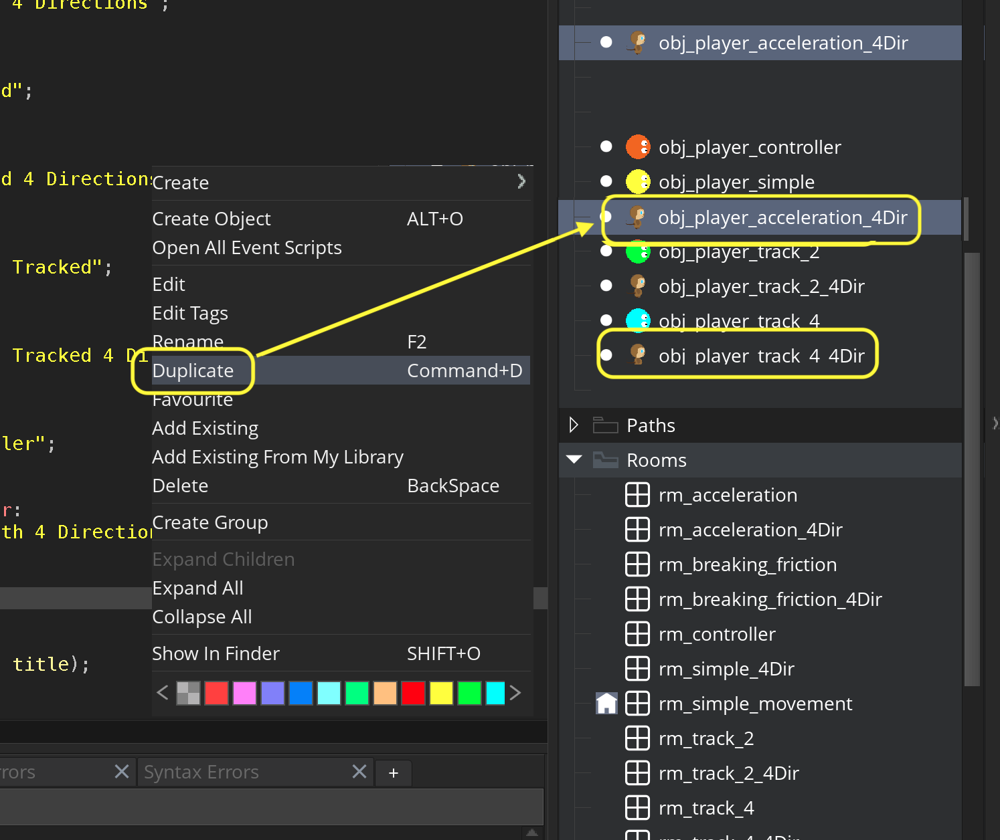
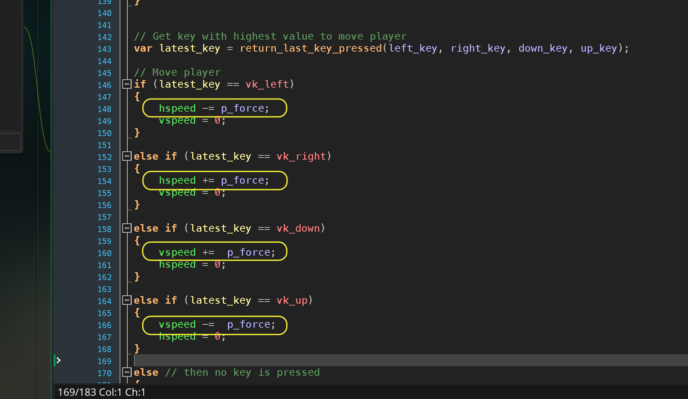

### Acceleration

[previous](../gamepad/README.md#user-content-using-a-gamepad) • [home](../README.md#user-content-gms2-move-in-4-directions) • [next](../)

Our player is at maximum speed right away.  There is no sense of them having a force applied and going towards max speed.  Lets implement a more sophisticated physcis model starting by addin a force to accelerate to terminal velocity.

 

---

##### `Step 1.`\|`4DIR`|:small_blue_diamond:

Complete the [Four Keys Tracked with Animated Player](../four-4dir/README.md#user-content-four-keys-tracked-with-animated-player) walk through.  We will use this as our starting off point. 

Duplicate **obj_player_track_4_4Dir** and name the object `obj_player_acceleratino_4Dir`.

##### `Step 2.`\|`4DIR`|:small_blue_diamond: :small_blue_diamond: 

*Right click* on **Rooms** and select **New | Room** and name it `rm_acceleration`. Change the **Room Order** to place this room on the top of the list or use the space bar.

*Drag and drop* **obj_game** and **obj_player_acceleration_4Dir** into the level.

##### `Step 3.`\|`4DIR`|:small_blue_diamond: :small_blue_diamond: :small_blue_diamond:

Go to **obj_game | Draw GUI** and add a title for this level.

##### `Step 4.`\|`4DIR`|:small_blue_diamond: :small_blue_diamond: :small_blue_diamond: :small_blue_diamond:
 
 Now open up **obj_player_acceleration_4Dir | Step** event.  Lets accept both keyboard **and** gamepad inputs.  So add an or (||) statement so that both inputs will work.

##### `Step 5.`\|`4DIR`| :small_orange_diamond:

Now *press* the <kbd>Play</kbd> button in the top menu bar to launch the game. Now you can play the game with both gamepad and keyboard!

##### `Step 6.`\|`4DIR`| :small_orange_diamond: :small_blue_diamond:

Now we want to add a force to the player each frame so they accelerate and don't hit their maximum speed right away.  Open up **obj_player_accelerate_4Dir | Create** event add a variable called `p_force` to the script and set it to a very small number like `0.1`.  It will run every frame so 60 times a second.

##### `Step 7.`\|`4DIR`| :small_orange_diamond: :small_blue_diamond: :small_blue_diamond:

Now open up **obj_player_accelerate_4Dir | Step**  event and change the variable we use for acceleration and instead of setting it, add or subtract depending on the direction you are moving in.

##### `Step 8.`\|`4DIR`| :small_orange_diamond: :small_blue_diamond: :small_blue_diamond: :small_blue_diamond:

Now *press* the <kbd>Play</kbd> button in the top menu bar to launch the game. Now when you move you keep speeding up endlessly until you go too fast to see the player.

##### `Step 9.`\|`4DIR`| :small_orange_diamond: :small_blue_diamond: :small_blue_diamond: :small_blue_diamond: :small_blue_diamond:

##### `Step 10.`\|`4DIR`| :large_blue_diamond:

##### `Step 11.`\|`4DIR`| :large_blue_diamond: :small_blue_diamond: 

##### `Step 12.`\|`4DIR`| :large_blue_diamond: :small_blue_diamond: :small_blue_diamond: 

##### `Step 13.`\|`4DIR`| :large_blue_diamond: :small_blue_diamond: :small_blue_diamond:  :small_blue_diamond: 

##### `Step 14.`\|`4DIR`| :large_blue_diamond: :small_blue_diamond: :small_blue_diamond: :small_blue_diamond:  :small_blue_diamond: 

##### `Step 15.`\|`4DIR`| :large_blue_diamond: :small_orange_diamond: 

##### `Step 16.`\|`4DIR`| :large_blue_diamond: :small_orange_diamond:   :small_blue_diamond: 

##### `Step 17.`\|`4DIR`| :large_blue_diamond: :small_orange_diamond: :small_blue_diamond: :small_blue_diamond:

##### `Step 18.`\|`4DIR`| :large_blue_diamond: :small_orange_diamond: :small_blue_diamond: :small_blue_diamond: :small_blue_diamond:

##### `Step 19.`\|`4DIR`| :large_blue_diamond: :small_orange_diamond: :small_blue_diamond: :small_blue_diamond: :small_blue_diamond: :small_blue_diamond:

##### `Step 20.`\|`4DIR`| :large_blue_diamond: :large_blue_diamond:

##### `Step 21.`\|`4DIR`| :large_blue_diamond: :large_blue_diamond: :small_blue_diamond:

___

| [previous](../gamepad/README.md#user-content-using-a-gamepad)| [home](../README.md#user-content-gms2-move-in-4-directions) | [next](../)|
|---|---|---|
