### Four Keys Tracked with Animated Player

[previous](../four-keys/README.md#user-content-four-keys-tracked) • [home](../README.md#user-content-gms2-move-in-4-directions) • [next](../)

Lets add an animated player instead of a single frame sprite and switch between then.

 

---

##### `Step 1.`\|`4DIR`|:small_blue_diamond:

If you do not have the monkey character moving in four directions then download the [player sprites](../Assets/4DirectionAnimations.yymps). Go back to **GameMaker** and make sure you have an existing [GML Project](https://github.com/maubanel/GMS2-Snippets/blob/main/rename-project/README.md#user-content-rename-gms2-project).

Go back to **GameMaker** and press **Tools | Import Local Package**.

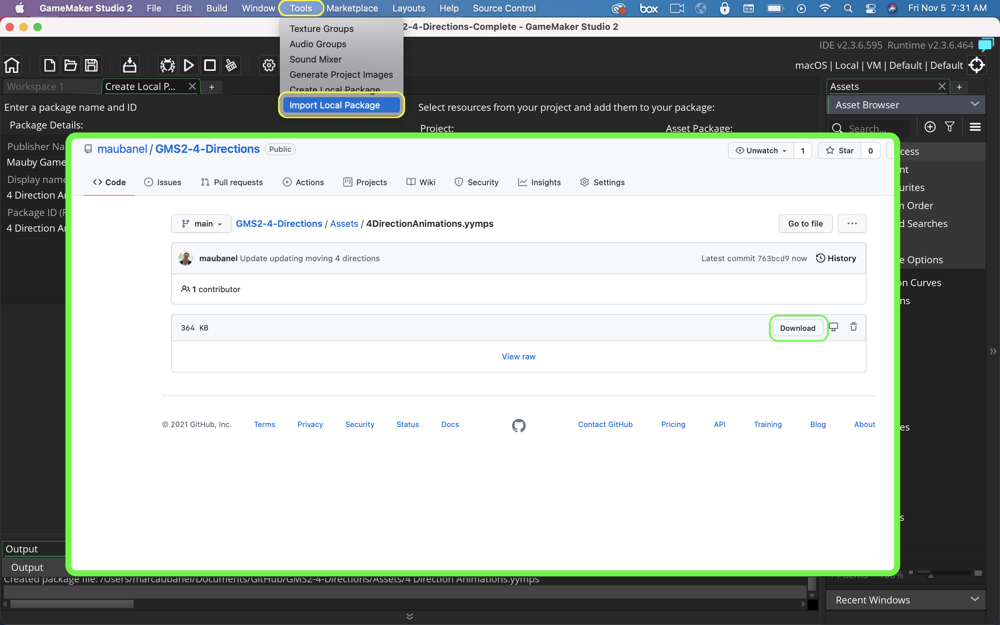

##### `Step 2.`\|`4DIR`|:small_blue_diamond: :small_blue_diamond: 

Select the package you just downloaded **4DirectionAnimations.yymps**.  Select the **Sprites** folder and press the <kbd>Add All</kbd> button.  This will move the contents of the folder with 4 animations to the right.  Press the <kbd>Import</kbd> button to import the animations.

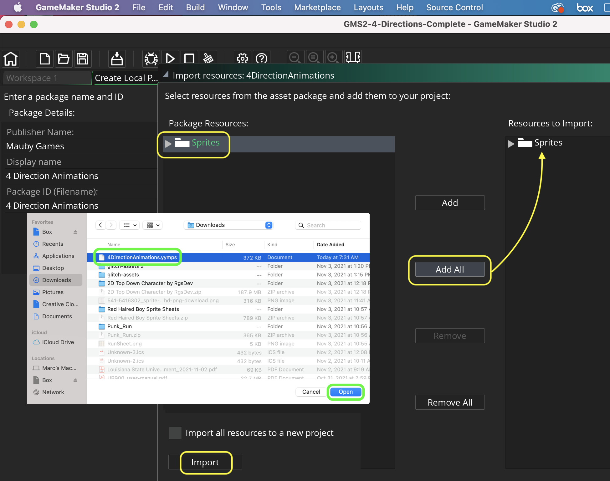

##### `Step 3.`\|`4DIR`|:small_blue_diamond: :small_blue_diamond: :small_blue_diamond:

This will import 4 animations to the **Sprites | 4Dir** folder.  You will have **spr_player_left**, **spr_player_right**, **spr_player_up** and **spr_player_down**.

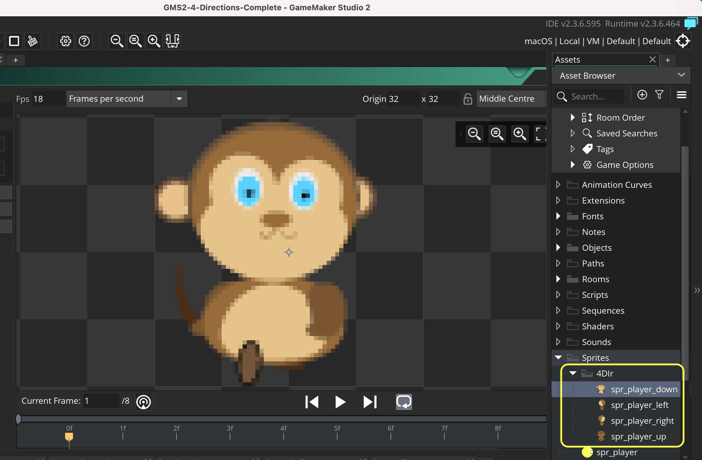

##### `Step 4.`\|`4DIR`|:small_blue_diamond: :small_blue_diamond: :small_blue_diamond: :small_blue_diamond:

Open up the animation and press the <kbd>Run Animation</kbd> button. You will see the player animates in four directions.

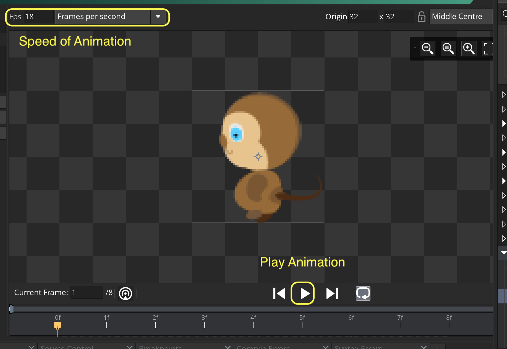

##### `Step 5.`\|`4DIR`| :small_orange_diamond:

Complete the [last Four Keys walk through](../four-keys/README.md#user-content-four-keys-tracked) so you have a final game object **obj_player_track_4**. Right click and duplicate the object and call it `obj_player_track_4_4Dir`.  Assign the `spr_player_right` sprite as the default sprite. 

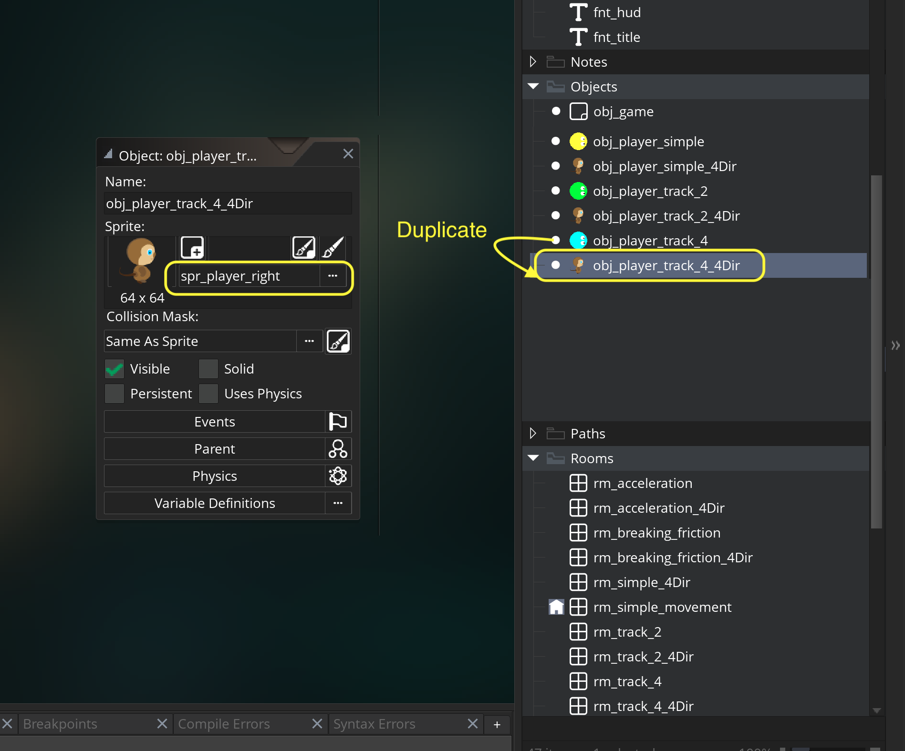

##### `Step 6.`\|`4DIR`| :small_orange_diamond: :small_blue_diamond:

*Right click* on **Rooms** and select **New | Room** and name it `rm_track_4_4Dir
`. Change the **Room Order** to place this room on the top of the list or in the order you would like. Drag and drop **obj_player_track_4_4Dir** and **obj_game** into the level.

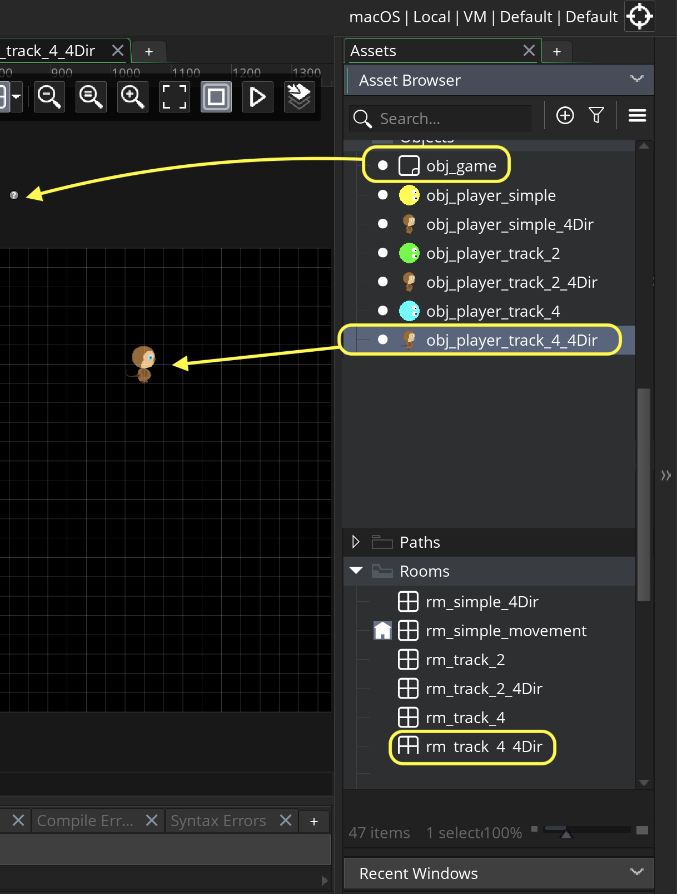

##### `Step 7.`\|`4DIR`| :small_orange_diamond: :small_blue_diamond: :small_blue_diamond:

Open up **obj_game | Draw GUI** script and add this title to the draw event.

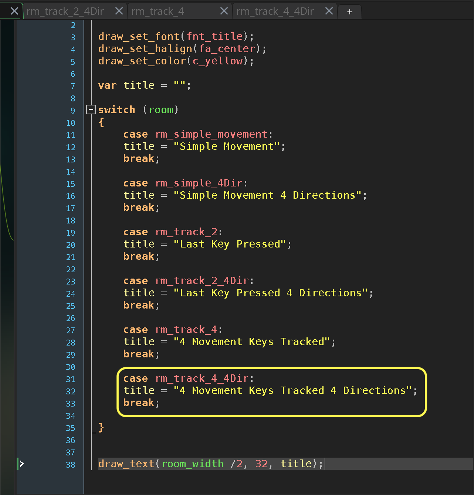

##### `Step 8.`\|`4DIR`| :small_orange_diamond: :small_blue_diamond: :small_blue_diamond: :small_blue_diamond:

Now open up **obj_player_track_4_4Dir | Draw Gui** and add the `speed`, `hspeed`, `vspeed` and `direction` to the display to see what is happening to the physics of the player.

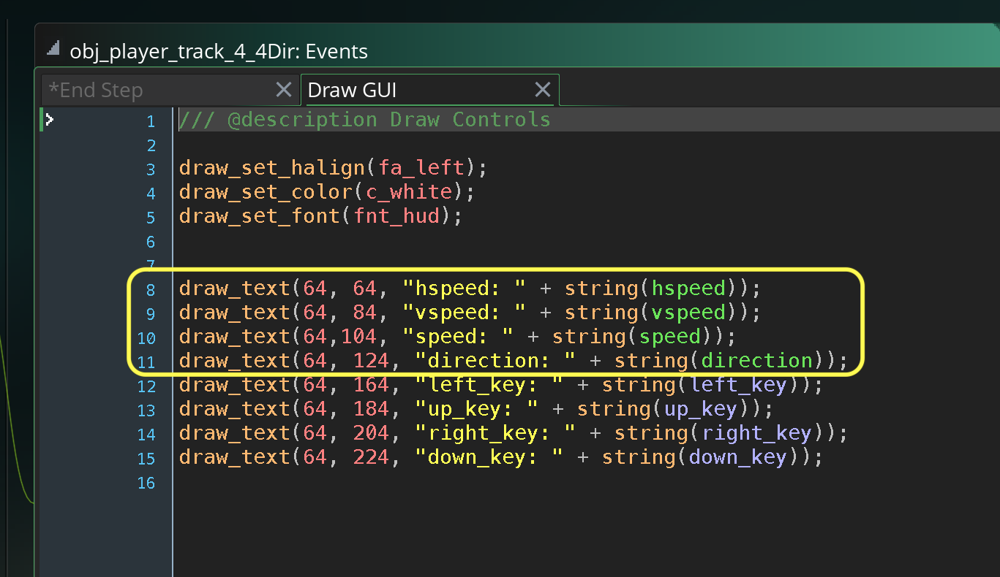

##### `Step 9.`\|`4DIR`| :small_orange_diamond: :small_blue_diamond: :small_blue_diamond: :small_blue_diamond: :small_blue_diamond:

Now *press* the <kbd>Play</kbd> button in the top menu bar to launch the game. Now this is silly we rotate the sprite which is not what we would like.

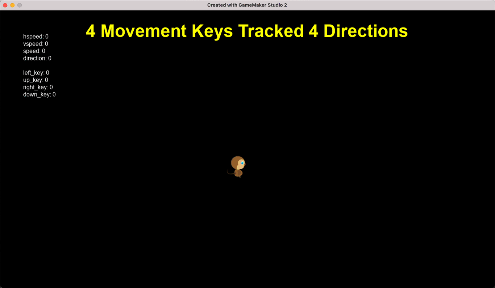

##### `Step 10.`\|`4DIR`| :large_blue_diamond:

So with using just `hspeed` and `vspeed` and zeroing out the unused axis we guarantee that our angle is precisely `0`, `90`, `180` or `270`.  We can use **[sprite_index](https://manual.yoyogames.com/GameMaker_Language/GML_Reference/Asset_Management/Sprites/Sprite_Instance_Variables/sprite_index.htm)** to get change the sprite the object is pointing to. 

> You can change it to give the instance a different sprite by giving it the name of a sprite from the resource tree or by using a variable that has an externally loaded sprite indexed in it. Changing the sprite does not change the index of the currently visible frame, so if you change the sprite on frame number 3, the new sprite will be drawn with that frame visible (assuming it has the same number of frames). - GameMaker Manual

Now we can use a `switch` statement (instead of `if.. else if chain) to select a different animation depending on the direction the player is pointing in. Open up **obj_player_track_2_4Dir | End Step** script and replace the old contents with this switching logic.

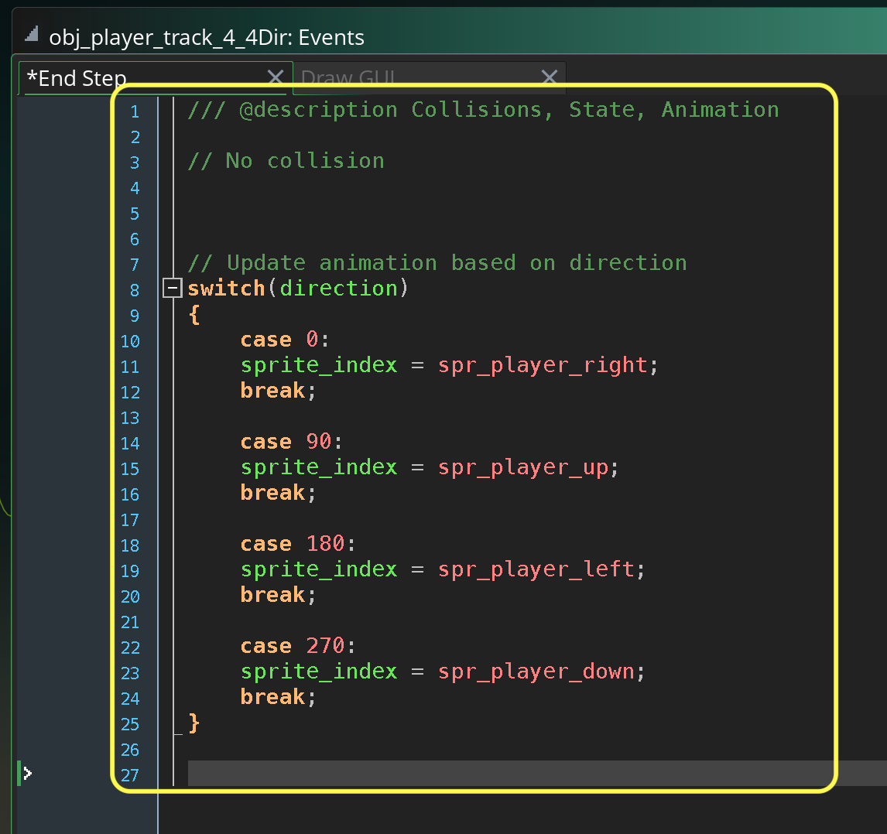

##### `Step 11.`\|`4DIR`| :large_blue_diamond: :small_blue_diamond: 

Now *press* the <kbd>Play</kbd> button in the top menu bar to launch the game. This looks a lot better and the player turns correctly.  Notice that the player does not stop animating.  We really have two states one where they are walking and another where they are idle.

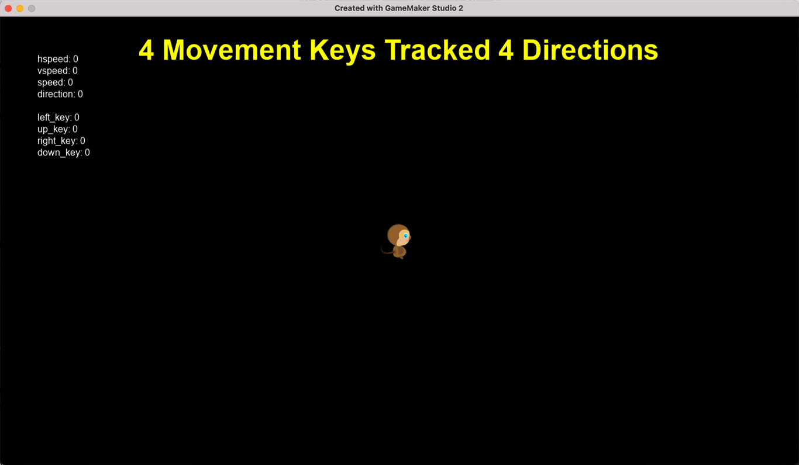

##### `Step 12.`\|`4DIR`| :large_blue_diamond: :small_blue_diamond: :small_blue_diamond: 

Open up all four animations and press the <kbd>Edit Image</kbd> button.  You will notice that on the third frame is the one where both feet are on the ground.  We will use this frame as our **idle**.  We will use **[image_index](https://manual.yoyogames.com/GameMaker_Language/GML_Reference/Asset_Management/Sprites/Sprite_Instance_Variables/image_index.htm)** to pick this frame and **[image_speed](https://manual.yoyogames.com/GameMaker_Language/GML_Reference/Asset_Management/Sprites/Sprite_Instance_Variables/image_speed.htm)** to start and stop the animation.

> The image_speed variable determines the speed in which GameMaker Studio 2 will cycle through the sub-images for the current instance sprite. The speed value given is a multiplier, with 1 being the default value, and setting it to 0.5 will half the animation speed - as set in the Sprite Editor or Image Editor - GameMaker Manual

So when the player is not moving we will set the `image_speed = 0` and when they are moving set it to `1`.

For `image_index`, the frame count starts at `0` so the third frame will be set as the number `2` (0, 1, 2).

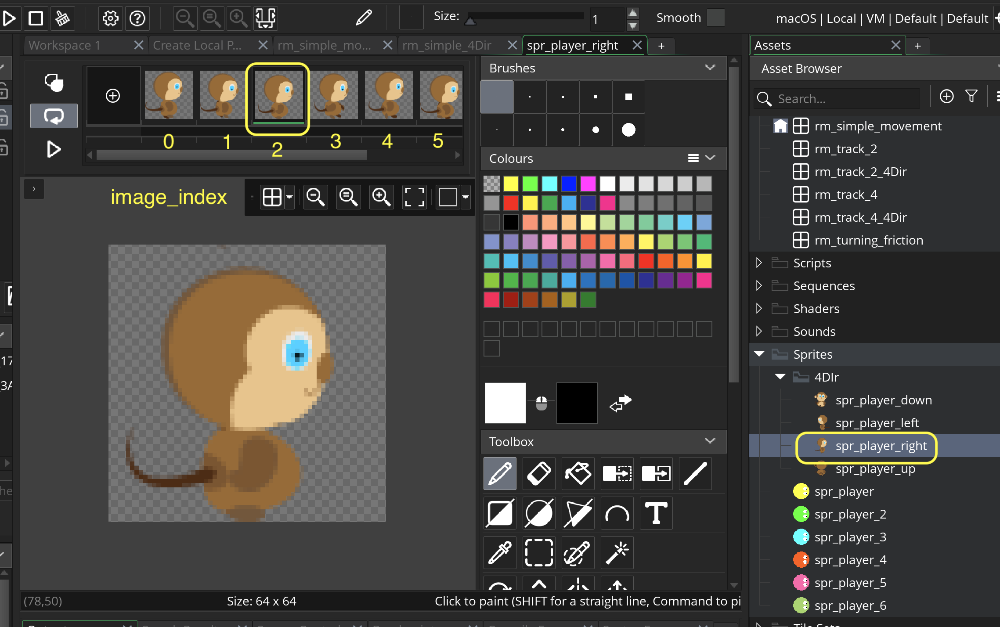

##### `Step 13.`\|`4DIR`| :large_blue_diamond: :small_blue_diamond: :small_blue_diamond:  :small_blue_diamond: 

Open up **obj_player_track_2_4Dir | End Step** and add before the animation switching a check.

* If speed is not 0 (player moving) then `image_speed = 1;`
* Else if player is stopped `image_speed = 0;` and we want the third frame where both feet are standing on the ground `image_index = 2;`.

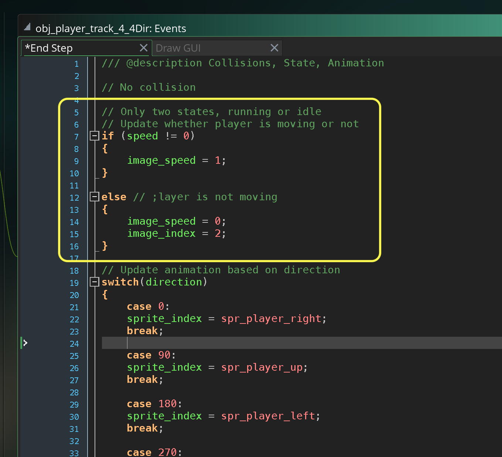

##### `Step 14.`\|`4DIR`| :large_blue_diamond: :small_blue_diamond: :small_blue_diamond: :small_blue_diamond:  :small_blue_diamond: 

##### `Step 15.`\|`4DIR`| :large_blue_diamond: :small_orange_diamond: 

##### `Step 16.`\|`4DIR`| :large_blue_diamond: :small_orange_diamond:   :small_blue_diamond: 

##### `Step 17.`\|`4DIR`| :large_blue_diamond: :small_orange_diamond: :small_blue_diamond: :small_blue_diamond:

##### `Step 18.`\|`4DIR`| :large_blue_diamond: :small_orange_diamond: :small_blue_diamond: :small_blue_diamond: :small_blue_diamond:

##### `Step 19.`\|`4DIR`| :large_blue_diamond: :small_orange_diamond: :small_blue_diamond: :small_blue_diamond: :small_blue_diamond: :small_blue_diamond:

##### `Step 20.`\|`4DIR`| :large_blue_diamond: :large_blue_diamond:

##### `Step 21.`\|`4DIR`| :large_blue_diamond: :large_blue_diamond: :small_blue_diamond:

___

| [previous](../four-keys/README.md#user-content-four-keys-tracked)| [home](../README.md#user-content-gms2-move-in-4-directions) | [next](../)|
|---|---|---|
