### Four Keys Tracked

[previous](../last-4dir/README.md#user-content-last-key-pressed-with-animated-player) • [home](../README.md#user-content-gms2-move-in-4-directions) • [next](../four-4dir/README.md#user-content-four-keys-tracked-with-animated-player)

Here is the gold standard for four key controls.  We will track the order that each key is pressed in.  This way if you have all four keys pressed the order you release the keys will be reflected in the game picking the correct direction.  This makes the whole process a lot more complicated as we need to do a lot more work to achieve this goal.

The last [walkthrough](../last-key/README.md#user-content-last-key-pressed) properly tracked two keys (fell apart when third or fourth key is pressed).  This one solves this issue.

 

---

##### `Step 1.`\|`4DIR`|:small_blue_diamond:

Create a sprite called `spr_player` (I have called mine `sp_player_3` as I have completed the previous walk throughs).  Press the <kbd>Edit Image</kbd> button and draw a player and pick a color for it.  Change the **Origin** to `Middle | Center`.

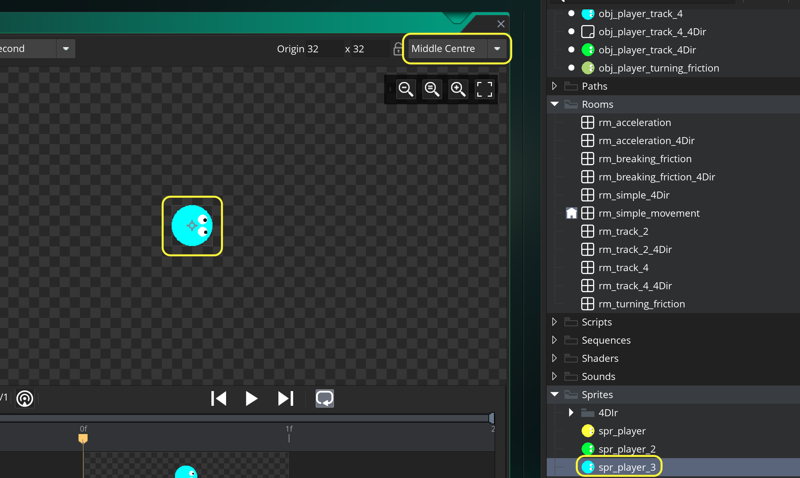

##### `Step 2.`\|`4DIR`|:small_blue_diamond: :small_blue_diamond: 

*Right click* on **Objects** and select **New | Object** and name it `obj_player_track_4`. Set the **Sprite** to `spr_player` or `spr_player_3`.

##### `Step 3.`\|`4DIR`|:small_blue_diamond: :small_blue_diamond: :small_blue_diamond:

If you don't have the two fonts from the last exercise *Right click* on **Fonts** and select **New | Font** and name it `fnt_title`. Make the **Size** `36` and the **Style** `Bold`.

Add another font called `fnt_hud` with a **Size** of `12` and **Style** `Regular`.

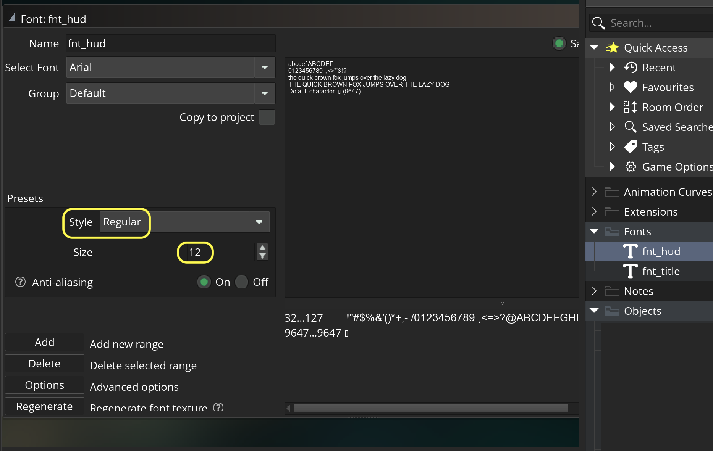

##### `Step 4.`\|`4DIR`|:small_blue_diamond: :small_blue_diamond: :small_blue_diamond: :small_blue_diamond:

If you don't already have an **obj_game** *right click* on **Objects** and select **New | Object** and name it `obj_game`. Press the <kbd>Add Event</kbd> and select a **Draw | Draw GUI** event.

* Set the font to **fnt_title**
* Center the text alignment
* Set the color to yellow
* Set up a temporary variable called `title`
* Switch on the room and set the **title** to `"4 Movement Keys Tracked"`
* Draw title

Don't include the `case rm_simple_movement:` if you do NOT have this room. Only include this if you have done the previous exercise.

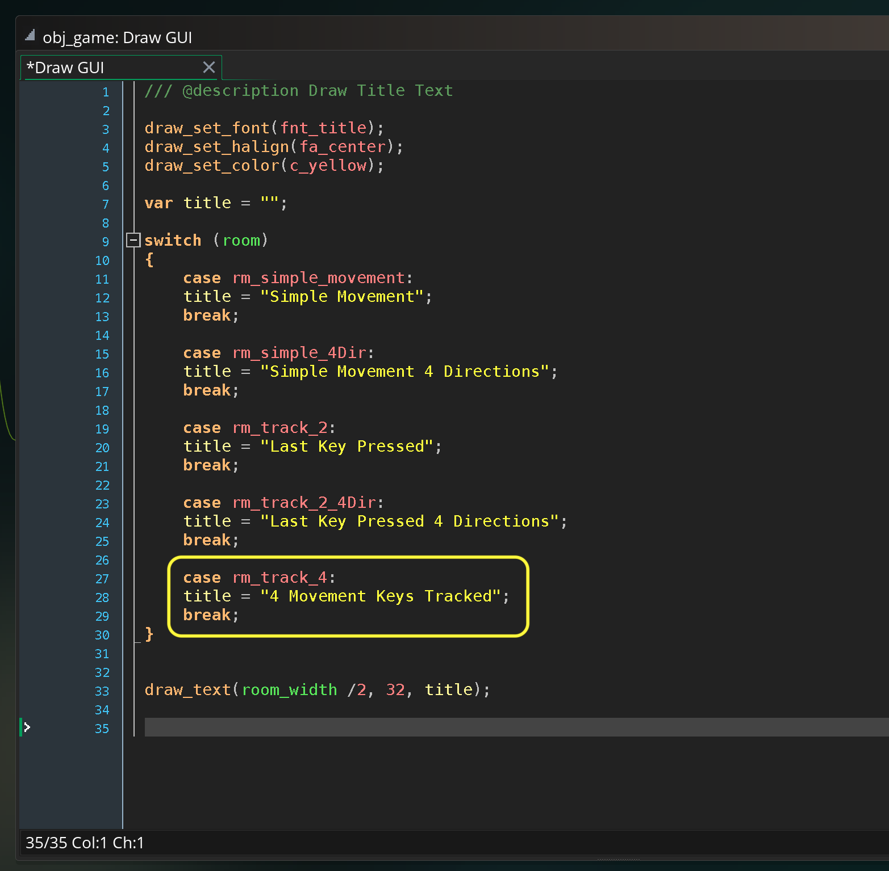

##### `Step 5.`\|`4DIR`| :small_orange_diamond:

Open up **obj_game**. Press the <kbd>Add Event</kbd> and select a **Step | Step** event. Only add this if you want to switch between rooms with the different implementations of the 4 way movement.  

* Check if space is pressed and if there is another room to go to
* If so, then go to next room
* Else if space is pressed, go back to first room (if it exists)

##### `Step 6.`\|`4DIR`| :small_orange_diamond: :small_blue_diamond:

*Right click* on **Rooms** and select **New | Room** and name it `rm_track_4`. Change the **Room Order** to place this room on the top of the list or you can leave it in order and press the <kbd>Space Bar</kbd> to change rooms if you have done the previous exercise and added the **Step** event to **obj_game**.

Draw  copy of **obj_player_track_4** and **obj_game** to the level.

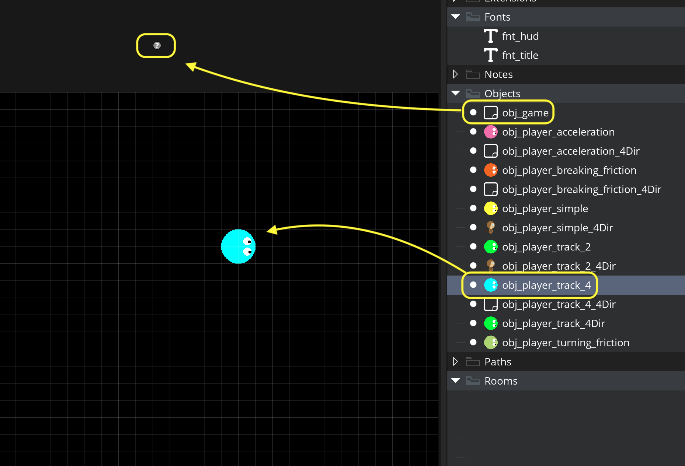

##### `Step 7.`\|`4DIR`| :small_orange_diamond: :small_blue_diamond: :small_blue_diamond:

Open up **obj_player_track_4**. Press the <kbd>Add Event</kbd> and select a **Create** event. 
* Center the player in the level 
* Create 4 variables to store which key was pressed in which order.  So `left_key`, `right_key`, `up_key`, `down_key` will be give a number between `1` and `4` in the order it was pressed.
* Create a final variable `last_number_of_keys` which we will use to see if the number of keys we have pressed last frame is less than the number of keys we have pressed now.  You will see why later why we need to track this.

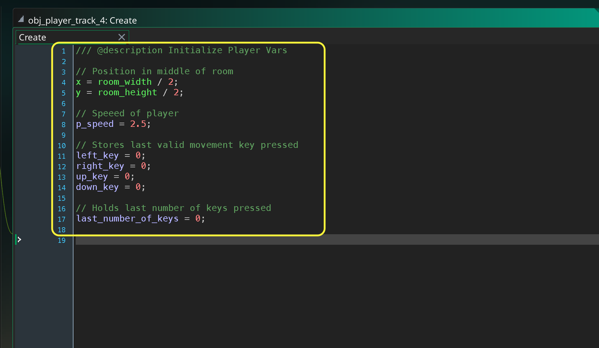

##### `Step 8.`\|`4DIR`| :small_orange_diamond: :small_blue_diamond: :small_blue_diamond: :small_blue_diamond:

Press the <kbd>Add Event</kbd> and select a **Draw | Draw GUI** event.

* Change the alignment to left aligned
* Change the font color
* Change fonts to `fnt_hud`
* draw the four keys integer and it should be `0` if not pressed or `1` through `4` depending on the order

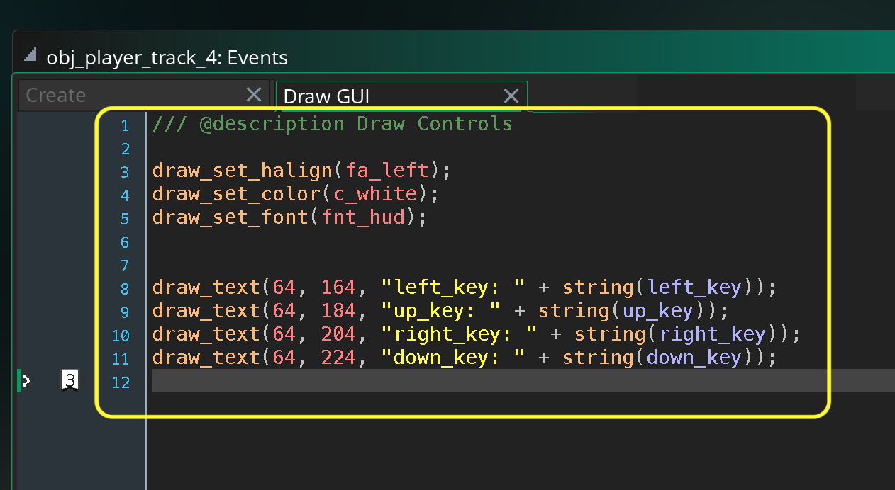

##### `Step 9.`\|`4DIR`| :small_orange_diamond: :small_blue_diamond: :small_blue_diamond: :small_blue_diamond: :small_blue_diamond:

Press the <kbd>Add Event</kbd> and select a **Step | Step** event.

* Store the status of whether the left, right, down up up key is pressed
* Add up the total number of keys pressed this frame and store in `number_of_keys`.
* Check to see if a button was not pressed last frame and assign it the `number_of_keys`

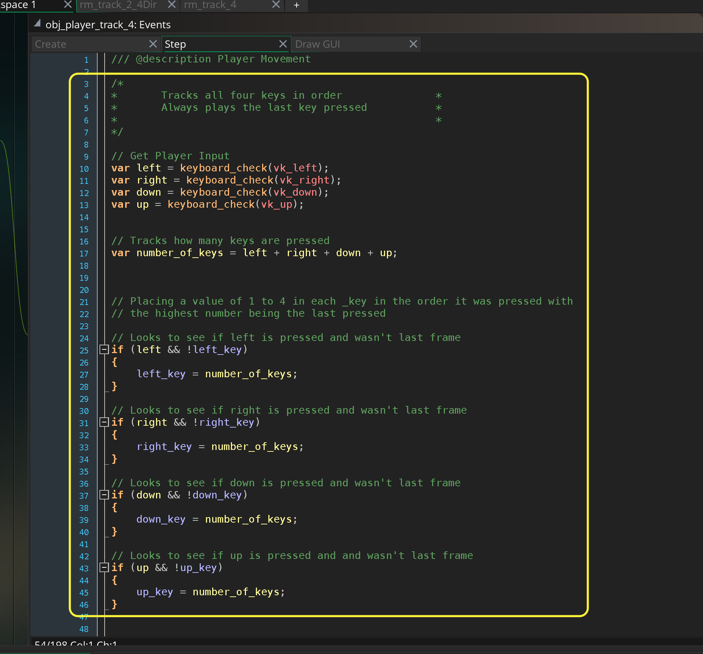

##### `Step 10.`\|`4DIR`| :large_blue_diamond:

Now *press* the <kbd>Play</kbd> button in the top menu bar to launch the game. Press four keys one after another and see that each key gets the appropriate number.  The first key pressed gets `1` and the last key pressed gets `4`.  Now this only sets it when it wasn't set the last frame.  So we cannot retrack the order when we release the keys and press them again.

##### `Step 11.`\|`4DIR`| :large_blue_diamond: :small_blue_diamond: 

So how do we reset keys back to `0` when they are let go.  This is very simple.  Now since the key will be a `1` if `keyboard_check_pressed(key)` returns **true** or `0` if **false**. So if we multiply the key by the press if that key is pressed it will multiply the number by 1 and stay the same.  But if the key is let go it will multiply by 0 getting the behavior we desire.

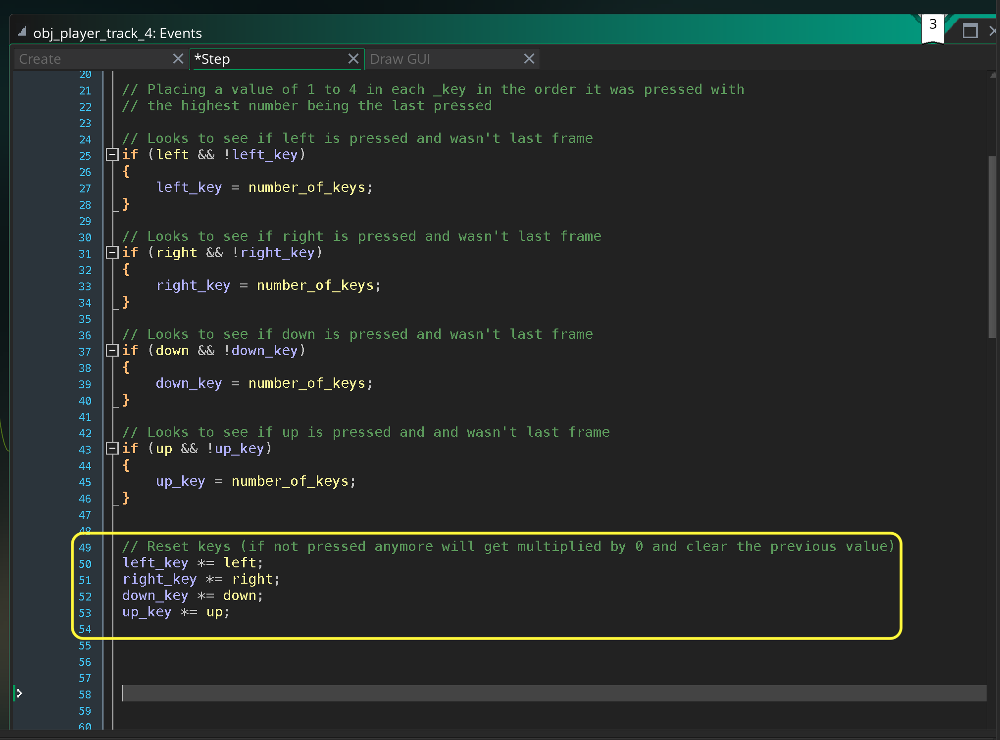

##### `Step 12.`\|`4DIR`| :large_blue_diamond: :small_blue_diamond: :small_blue_diamond: 

Now *press* the <kbd>Play</kbd> button in the top menu bar to launch the game. Now if you press four keys, then let them go and press 4 more - we get the behavior we desire.  There are still lots of issues.  One is what if I press two keys during the same frame, that key gets the same number.

##### `Step 13.`\|`4DIR`| :large_blue_diamond: :small_blue_diamond: :small_blue_diamond:  :small_blue_diamond: 

Now lets make a copy of **number_of_keys** and store it in `key_holder`.  I don't want to alter the **number_of_keys** variable as we want it to represent what it says.  So each time we set a key to **key_holder** we will subtract `1` from it. That way it will put a different number on each key and the order that it will be selected if they are pressed at the same time is **left** first to *up* last (*left* would be `4` if all 4 are pressed at the same time and *up* would be `1`).

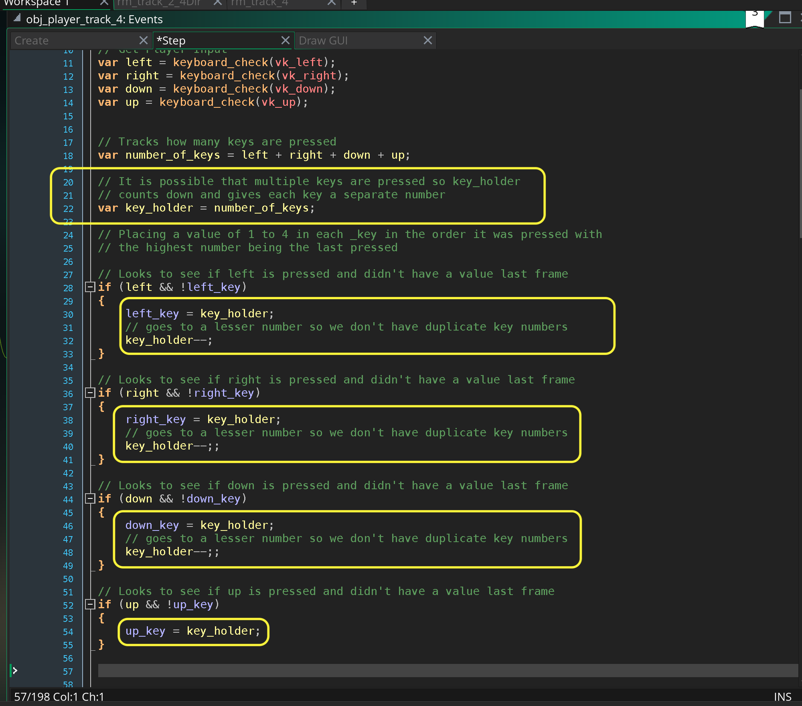

##### `Step 14.`\|`4DIR`| :large_blue_diamond: :small_blue_diamond: :small_blue_diamond: :small_blue_diamond:  :small_blue_diamond: 

Now no matter how many keys you press at the same time, they will all get assigned a different number.

##### `Step 15.`\|`4DIR`| :large_blue_diamond: :small_orange_diamond: 

We have a large remaining problem.  Lets say we have three buttons held.  We let go of button 1 and 2.  So we only have button 3 left.  The number stays at 3.  So if we press two more buttons after the order is wrong and there are two buttons with number 3. 

##### `Step 16.`\|`4DIR`| :large_blue_diamond: :small_orange_diamond:   :small_blue_diamond: 

We are going to write our first custom **[function](https://manual.yoyogames.com/GameMaker_Language/GML_Overview/Script_Functions.htm)**. I can create a script in the scripts folder and make that function global, but since I only need this for the player I can write the function in the same block of code and make it local to this game object.

This function will return the lowest numbered key based on a starting number.  So if you pass **starting_num** as `2` it will return the lowest key number that is `2` or higher.  So if I only have a key with `3` it will return that key from the function.

##### `Step 17.`\|`4DIR`| :large_blue_diamond: :small_orange_diamond: :small_blue_diamond: :small_blue_diamond:

Now open up the **obj_player_track_4 | Step** event and add:

* Check to see if the last number of keys pressed is greater than the current number of keys pressed (so we go from 4 to 3 for example).  If there is at least one key pressed and less keyss from last frame then reorder keys.

* Loop through each key from the lowest to the highest.  
* Return the next lowest number.  Check all four keys to see if it is the lowest number and that it is larger than the loop number (`i`).  If so set that new lower number
* Increment the loop by 1.

Now after this check we need to add as the last thing what the current `number_of`keys` is.  This will be stored in `last_number_of_keys` that we will check next time this event is triggerd.

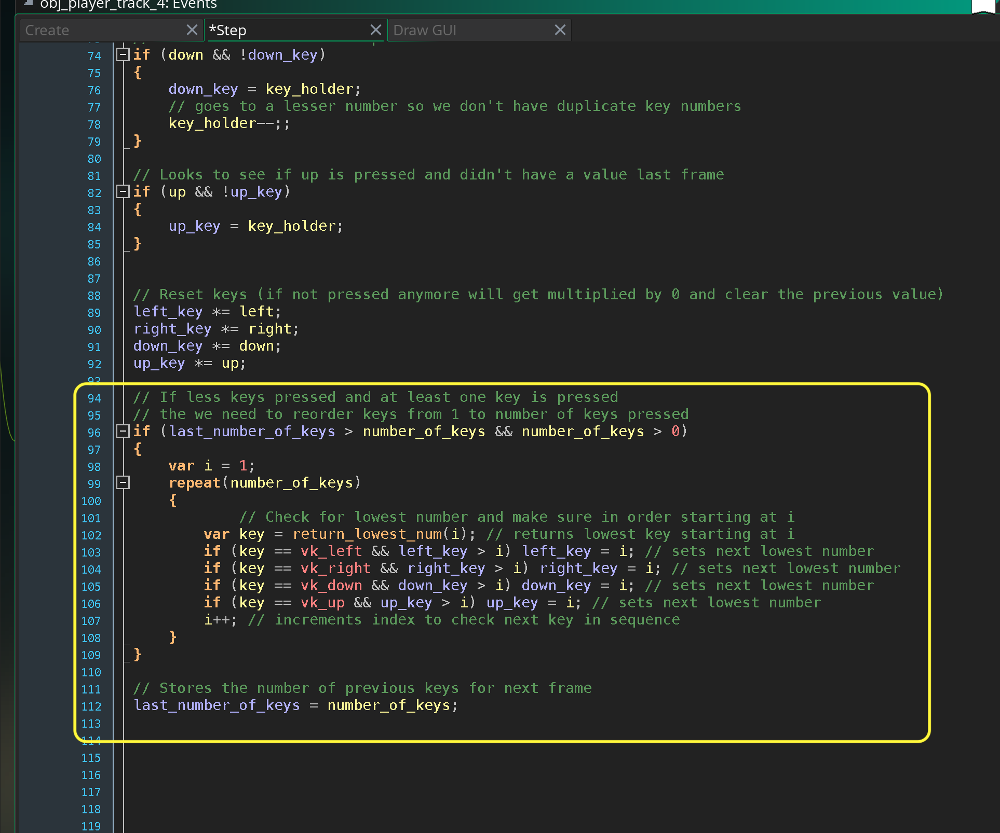

##### `Step 18.`\|`4DIR`| :large_blue_diamond: :small_orange_diamond: :small_blue_diamond: :small_blue_diamond: :small_blue_diamond:

Now *press* the <kbd>Play</kbd> button in the top menu bar to launch the game. Now let go of keys and the numbers should always be resaled **in order** to the current number of keys pressed.

##### `Step 19.`\|`4DIR`| :large_blue_diamond: :small_orange_diamond: :small_blue_diamond: :small_blue_diamond: :small_blue_diamond: :small_blue_diamond:

Now we can move to animating the player.  First we need to know which key has the highest number (the last key pressed).  So under the previous function we will add a new one that's only job is to return the key with the highest number.

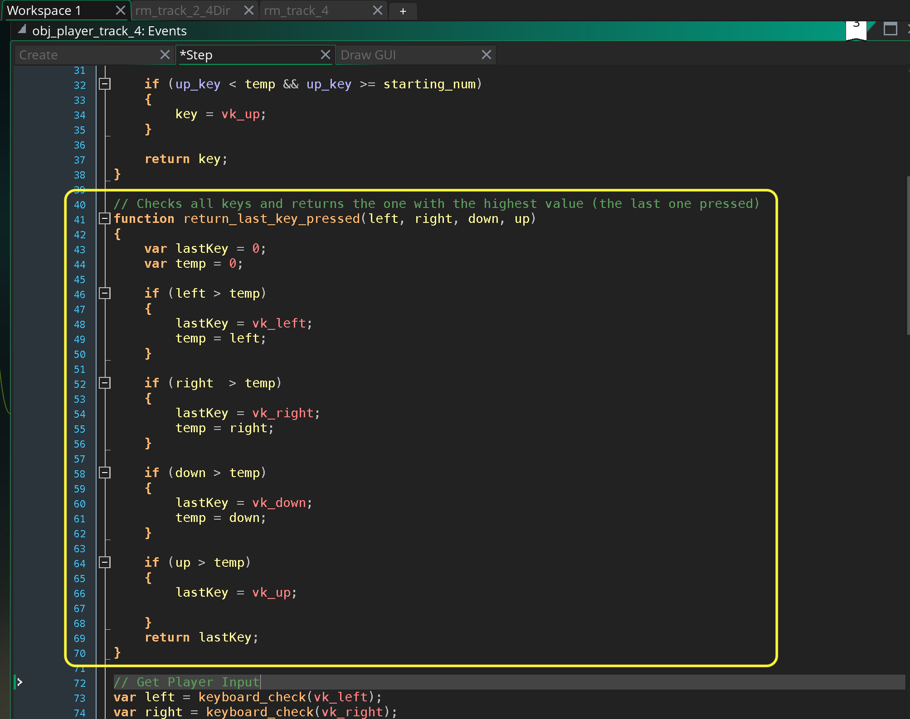

##### `Step 20.`\|`4DIR`| :large_blue_diamond: :large_blue_diamond:

So now we can move the player.  We get the `latest_key` by calling the above function passing it our four directions.  We then check to see what direction the last key pressed is and move them in the correct direction.

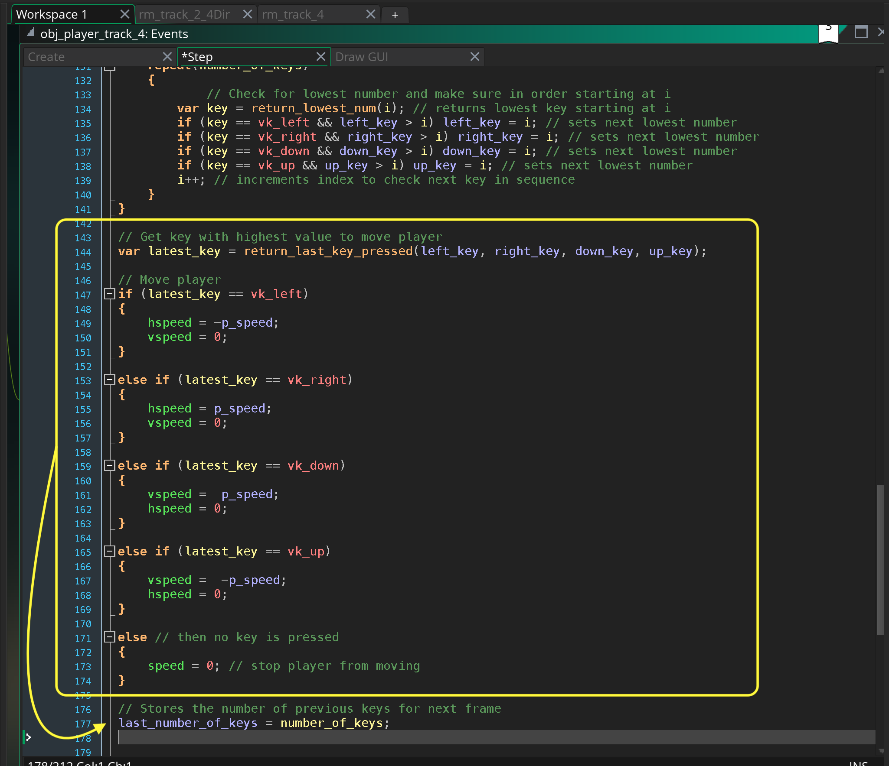

##### `Step 21.`\|`4DIR`| :large_blue_diamond: :large_blue_diamond: :small_blue_diamond:

Now *press* the <kbd>Play</kbd> button in the top menu bar to launch the game. Now you will move in the correct descending order when pressing and releasing all 4 buttons.  This makes sure that we are always playing the most recent button press tracking all four directions.

##### `Step 22.`\|`4DIR`| :large_blue_diamond: :large_blue_diamond: :small_blue_diamond: :small_blue_diamond:

Add a **move_wrap()** to stop the player from going off screen.

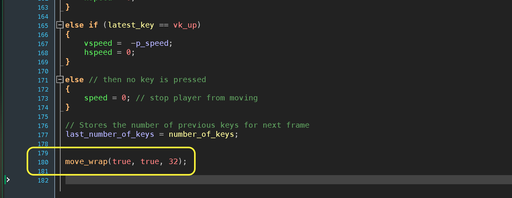

##### `Step 23.`\|`4DIR`| :large_blue_diamond: :large_blue_diamond: :small_blue_diamond: :small_blue_diamond: :small_blue_diamond:

Now since we would normally resolve collisions **before** we animate we need to wait until after the **step** event for the game to move the player if you are using `hspeed`, `vspeed` or `speed` to move the player. 

Press the <kbd>Add Event</kbd> and select a **Step | End Step** event.

Rotate the player in the direction they are moving.

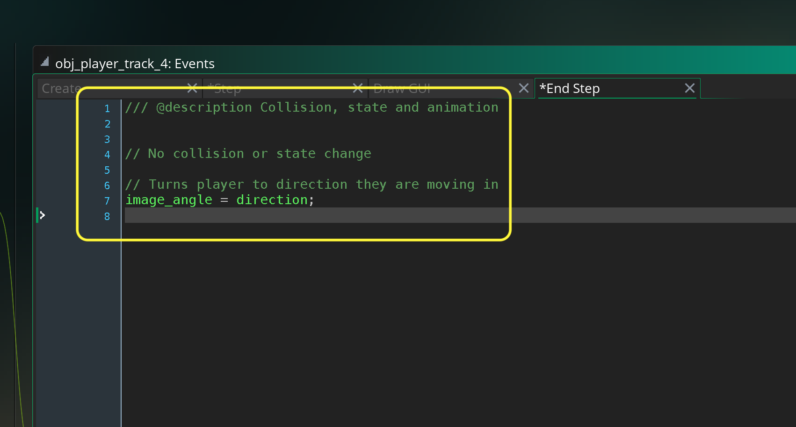

##### `Step 24.`\|`4DIR`| :large_blue_diamond: :large_blue_diamond: :small_blue_diamond: :small_blue_diamond: :small_blue_diamond: :small_blue_diamond:

Now *press* the <kbd>Play</kbd> button in the top menu bar to launch the game. This should produce perfect 4 direction movement.

Select the **File | Save Project** then press **File | Quit** to make sure everything in the game is saved. If you are using **GitHub** open up **GitHub Desktop** and add a title and longer description (if necessary) and press the <kbd>Commit to main</kbd> button. Finish by pressing **Push origin** to update the server with the latest changes.

___

| [previous](../last-4dir/README.md#user-content-last-key-pressed-with-animated-player)| [home](../README.md#user-content-gms2-move-in-4-directions) | [next](../four-4dir/README.md#user-content-four-keys-tracked-with-animated-player)|
|---|---|---|
