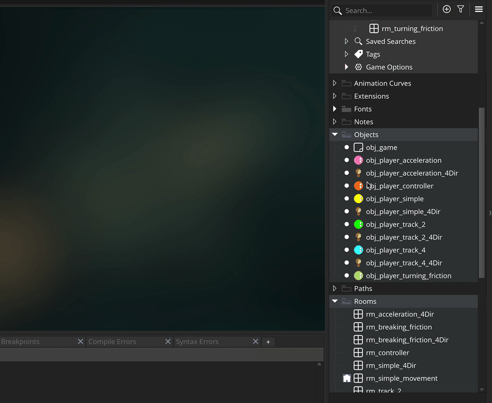
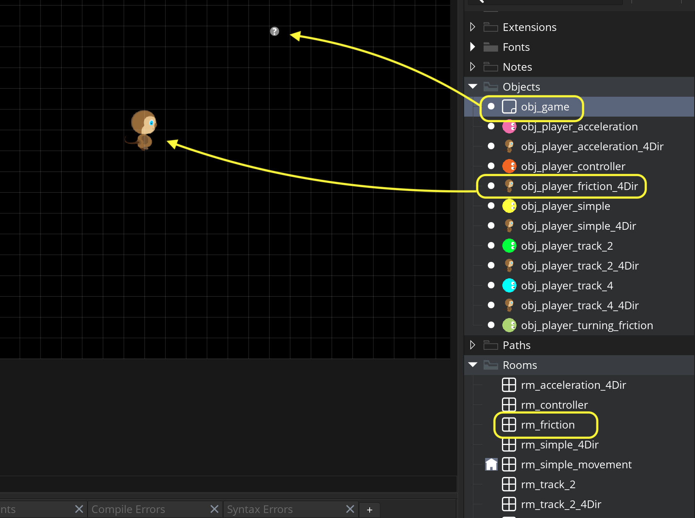
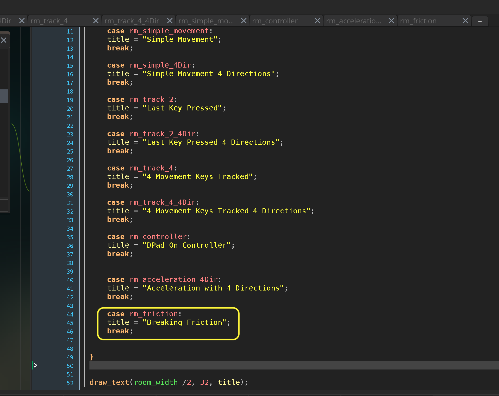
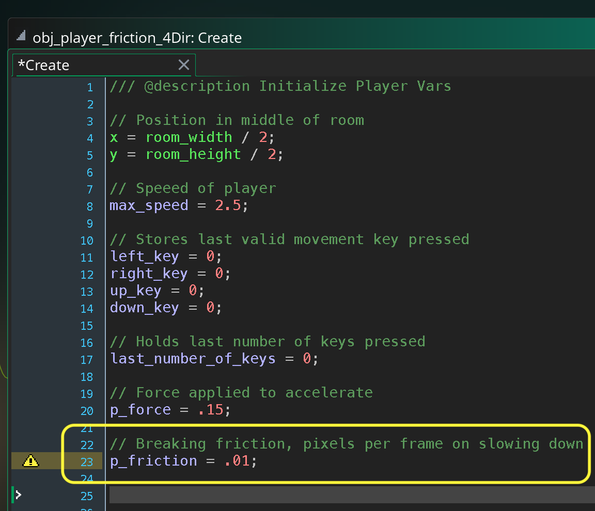
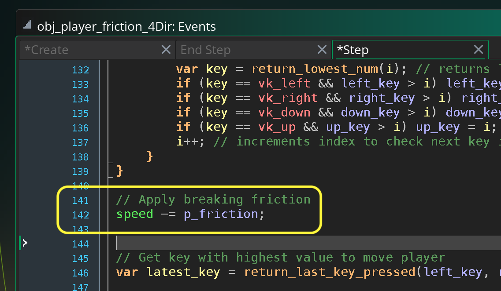
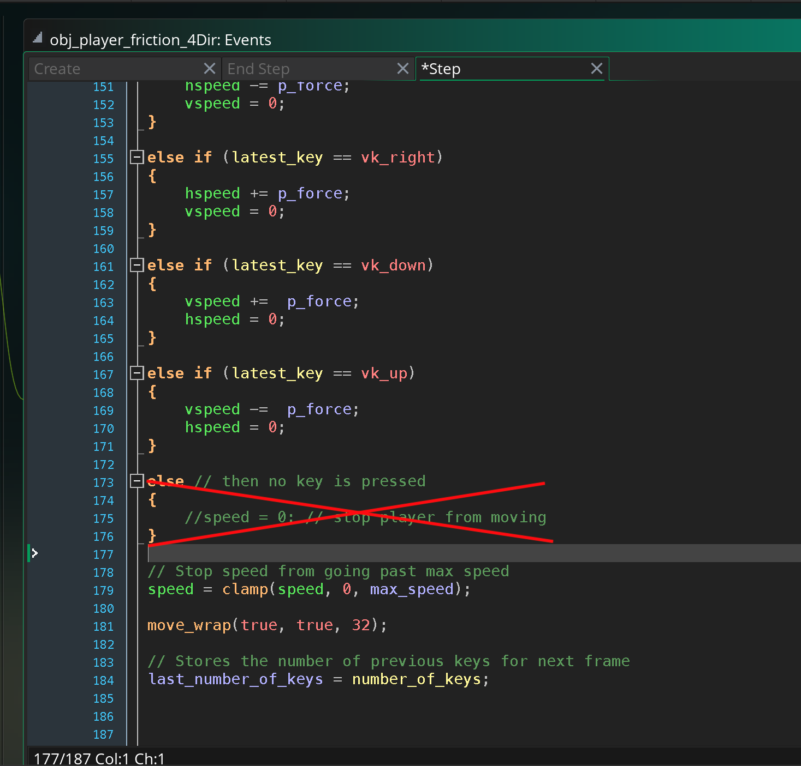
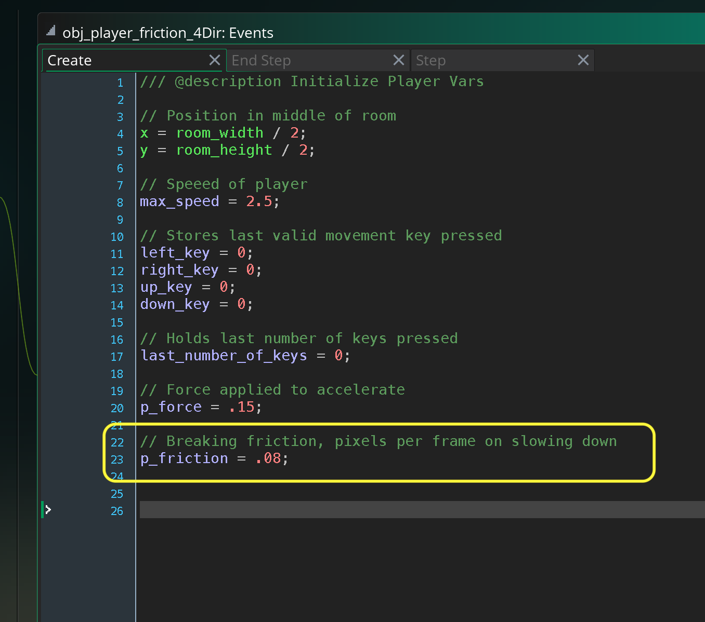

### Breaking Friction

[previous](../acceleration/README.md#user-content-acceleration) • [home](../README.md#user-content-gms2-move-in-4-directions) • [next](../rotate-down/README.md#user-content-rotate-top-down-animation)

Lets expand the physics model and alter the breaking friction of the character based on the surface they are traveling on.

 

---

##### `Step 1.`\|`4DIR`|:small_blue_diamond:

Complete the [Acceleration](../acceleration/README.md#user-content-acceleration) walk through.  We will use this as our starting off point and add friction. 

Duplicate **obj_player_acceleration_4Dir** and name the object `obj_player_friction_4Dir`.

##### `Step 2.`\|`4DIR`|:small_blue_diamond: :small_blue_diamond: 

*Right click* on **Rooms** and select **New | Room** and name it `rm_friction. Change the **Room Order** to place this room on the top of the list or use the space bar.

*Drag and drop* **obj_game** and **obj_player_friction_4Dir** into the level.

##### `Step 3.`\|`4DIR`|:small_blue_diamond: :small_blue_diamond: :small_blue_diamond:

Go to **obj_game | Draw GUI** and add a title for this level.

##### `Step 4.`\|`4DIR`|:small_blue_diamond: :small_blue_diamond: :small_blue_diamond: :small_blue_diamond:

Open up **obj_player_friction_4Dir | Create** event and add a `p_friction` variable and set it to a very low number like `.01` to test. 

##### `Step 5.`\|`4DIR`| :small_orange_diamond:

Now open up **obj_player_friction_4Dir | Step** and just before we apply physis lets remove a little bit from the `speed` as a frictional force that will slow the player down.

##### `Step 6.`\|`4DIR`| :small_orange_diamond: :small_blue_diamond:

At the bottom of the script we need to get rid of the instant breaking to `0` when you don't press buttons.  Delete the `speed = 0` and let the friction deplete the speed down to nothing.

##### `Step 7.`\|`4DIR`| :small_orange_diamond: :small_blue_diamond: :small_blue_diamond:

Now *press* the <kbd>Play</kbd> button in the top menu bar to launch the game. Now when you let go the player will very slowly come to a stop.

##### `Step 8.`\|`4DIR`| :small_orange_diamond: :small_blue_diamond: :small_blue_diamond: :small_blue_diamond:

Now you can adjut the `p_friction` in the player object's create event to your liking.

##### `Step 9.`\|`4DIR`| :small_orange_diamond: :small_blue_diamond: :small_blue_diamond: :small_blue_diamond: :small_blue_diamond:

Now *press* the <kbd>Play</kbd> button in the top menu bar to launch the game. Now you have a full physics model with acceleration and breaking friction working in your four directions of movement on both a keyboard and gamepad!

##### `Step 10.`\|`4DIR`| :large_blue_diamond:

Select the **File | Save Project** then press **File | Quit** to make sure everything in the game is saved. If you are using **GitHub** open up **GitHub Desktop** and add a title and longer description (if necessary) and press the <kbd>Commit to main</kbd> button. Finish by pressing **Push origin** to update the server with the latest changes.

___

| [previous](../acceleration/README.md#user-content-acceleration)| [home](../README.md#user-content-gms2-move-in-4-directions) | [next](../rotate-down/README.md#user-content-rotate-top-down-animation)|
|---|---|---|
