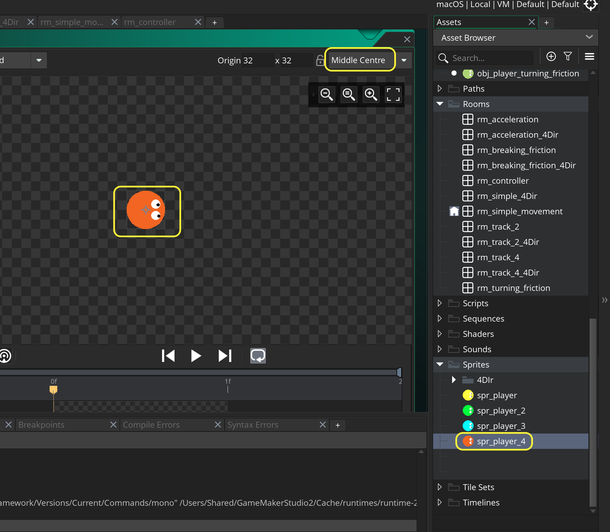

### Using a Gamepad

[previous](../four-4dir/README.md#user-content-four-keys-tracked-with-animated-player) • [home](../README.md#user-content-gms2-move-in-4-directions) • [next](../)

Adding a joystick is much easier as we only have one input device that gives us a direction and magnitude, so there are no multiple button issues we have to track. The best choice for the Windows PC is a XBOX controller and for the mac it is a PS3 or PS4 controller (the documentation says it only supports the PS3 controller on the mac, but the PS4 controller does work using bluetooth on 11.15).

We will be using the gamepad as opposed to the analogue stick as it feels weird to have an analogue stick with just 4 directions.

 

---

##### `Step 1.`\|`4DIR`|:small_blue_diamond:

Create a sprite called `spr_player` (I have called mine `spr_player_4` as I have it in a single project with the other implentations).  Press the <kbd>Edit Image</kbd> button and draw a player and pick a color for it.  Change the **Origin** to `Middle | Center`.

##### `Step 2.`\|`4DIR`|:small_blue_diamond: :small_blue_diamond: 

##### `Step 3.`\|`4DIR`|:small_blue_diamond: :small_blue_diamond: :small_blue_diamond:

##### `Step 4.`\|`4DIR`|:small_blue_diamond: :small_blue_diamond: :small_blue_diamond: :small_blue_diamond:

##### `Step 5.`\|`4DIR`| :small_orange_diamond:

##### `Step 6.`\|`4DIR`| :small_orange_diamond: :small_blue_diamond:

##### `Step 7.`\|`4DIR`| :small_orange_diamond: :small_blue_diamond: :small_blue_diamond:

##### `Step 8.`\|`4DIR`| :small_orange_diamond: :small_blue_diamond: :small_blue_diamond: :small_blue_diamond:

##### `Step 9.`\|`4DIR`| :small_orange_diamond: :small_blue_diamond: :small_blue_diamond: :small_blue_diamond: :small_blue_diamond:

##### `Step 10.`\|`4DIR`| :large_blue_diamond:

##### `Step 11.`\|`4DIR`| :large_blue_diamond: :small_blue_diamond: 

##### `Step 12.`\|`4DIR`| :large_blue_diamond: :small_blue_diamond: :small_blue_diamond: 

##### `Step 13.`\|`4DIR`| :large_blue_diamond: :small_blue_diamond: :small_blue_diamond:  :small_blue_diamond: 

##### `Step 14.`\|`4DIR`| :large_blue_diamond: :small_blue_diamond: :small_blue_diamond: :small_blue_diamond:  :small_blue_diamond: 

##### `Step 15.`\|`4DIR`| :large_blue_diamond: :small_orange_diamond: 

##### `Step 16.`\|`4DIR`| :large_blue_diamond: :small_orange_diamond:   :small_blue_diamond: 

##### `Step 17.`\|`4DIR`| :large_blue_diamond: :small_orange_diamond: :small_blue_diamond: :small_blue_diamond:

##### `Step 18.`\|`4DIR`| :large_blue_diamond: :small_orange_diamond: :small_blue_diamond: :small_blue_diamond: :small_blue_diamond:

##### `Step 19.`\|`4DIR`| :large_blue_diamond: :small_orange_diamond: :small_blue_diamond: :small_blue_diamond: :small_blue_diamond: :small_blue_diamond:

##### `Step 20.`\|`4DIR`| :large_blue_diamond: :large_blue_diamond:

##### `Step 21.`\|`4DIR`| :large_blue_diamond: :large_blue_diamond: :small_blue_diamond:

___

| [previous](../four-4dir/README.md#user-content-four-keys-tracked-with-animated-player)| [home](../README.md#user-content-gms2-move-in-4-directions) | [next](../)|
|---|---|---|
