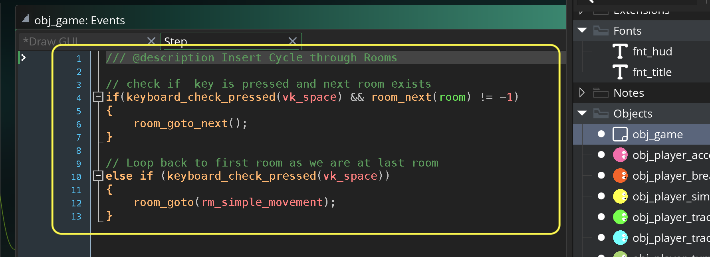

### Using a Gamepad

[previous](../four-4dir/README.md#user-content-four-keys-tracked-with-animated-player) • [home](../README.md#user-content-gms2-move-in-4-directions) • [next](../)

Adding a joystick is much easier as we only have one input device that gives us a direction and magnitude, so there are no multiple button issues we have to track. The best choice for the Windows PC is a XBOX controller and for the mac it is a PS3 or PS4 controller (the documentation says it only supports the PS3 controller on the mac, but the PS4 controller does work using bluetooth on 11.15).

We will be using the gamepad as opposed to the analogue stick as it feels weird to have an analogue stick with just 4 directions.

 

---

##### `Step 1.`\|`4DIR`|:small_blue_diamond:

Create a sprite called `spr_player` (I have called mine `spr_player_4` as I have it in a single project with the other implentations).  Press the <kbd>Edit Image</kbd> button and draw a player and pick a color for it.  Change the **Origin** to `Middle | Center`.

##### `Step 2.`\|`4DIR`|:small_blue_diamond: :small_blue_diamond: 

*Right click* on **Objects** and select **New | Object** and name it `obj_player_controller`. Set the **Sprite** to `spr_player` (or `spr_player_4`).

##### `Step 3.`\|`4DIR`|:small_blue_diamond: :small_blue_diamond: :small_blue_diamond:

In **obj_player_track_2** press the <kbd>Add Event</kbd> and select a **Create** event.

* Center the sprite in the room
* Add a variable to track the speed of the player in pixels per step called `p_speed`

##### `Step 4.`\|`4DIR`|:small_blue_diamond: :small_blue_diamond: :small_blue_diamond: :small_blue_diamond:

If you don't have the two fonts from the last exercise *Right click* on **Fonts** and select **New | Font** and name it `fnt_title`. Make the **Size** `36` and the **Style** `Bold`.

Add another font called `fnt_hud` with a **Size** of `12` and **Style** `Regular`.

##### `Step 5.`\|`4DIR`| :small_orange_diamond:

If you don't already have an **obj_game** *right click* on **Objects** and select **New | Object** and name it `obj_game`. Press the <kbd>Add Event</kbd> and select a **Draw | Draw GUI** event.

* Set the font to **fnt_title**
* Center the text alignment
* Set the color to yellow
* Set up a temporary variable called `title`
* Switch on the room and set the **title** to `"DPad on Controller"`
* Draw title

Don't include the rooms that you DO NOT have. Only include the other rooms if you have done the previous exercises.

##### `Step 6.`\|`4DIR`| :small_orange_diamond: :small_blue_diamond:

Open up **obj_game**. Press the <kbd>Add Event</kbd> and select a **Step | Step** event. Only add this if you want to switch between rooms with the different implementations of the 4 way movement.  

* Check if space is pressed and if there is another room to go to
* If so, then go to next room
* Else if space is pressed, go back to first room (if it exists)

##### `Step 7.`\|`4DIR`| :small_orange_diamond: :small_blue_diamond: :small_blue_diamond:

We want to print a message in the console to print a message and let us know which number the controller is that we are using.  We cannot do it in the **create** event as it does not run on the mac at the start of the first room (it does on the PC).  So we call it in 3 ticks in an alarm.  Open up **obj_game** and add press the <kbd>Add Event</kbd> button and select a **Create** event.  Trigger an alarm.

##### `Step 8.`\|`4DIR`| :small_orange_diamond: :small_blue_diamond: :small_blue_diamond: :small_blue_diamond:

Now we will loop through all the possible gamepads on the platform (Windows and Mac have a different max number) and print to console which are active and which are not active.

##### `Step 9.`\|`4DIR`| :small_orange_diamond: :small_blue_diamond: :small_blue_diamond: :small_blue_diamond: :small_blue_diamond:

Now *press* the <kbd>Play</kbd> button in the top menu bar to launch the game. Now look to see what index your controller is at.  In my case it found a controller at **index** `0`. If you don't see a controller, try rebooting the computer and starting this step over again.

##### `Step 10.`\|`4DIR`| :large_blue_diamond:

*Right click* on **Rooms** and select **New | Room** and name it `rm_controller`. Change the **Room Order** to place this room on the top of the list or you can leave it in order and press the <kbd>Space Bar</kbd> to change rooms if you have done the previous exercise and added the **Step** event to **obj_game**.

Drag a copy of **obj_player_controller** and **obj_game** to the level.

##### `Step 11.`\|`4DIR`| :large_blue_diamond: :small_blue_diamond: 

We will be using **[gamepad_button_check(device, button)](https://docs2.yoyogames.com/source/_build/3_scripting/4_gml_reference/controls/gamepad%20input/gamepad_button_check.html)**

> This function will return true or false depending on whether the given gamepad button is detected as being held down or not. - GameMaker Manual

We will be using `gp_padl`, `gp_padu`, `gp_padd` and `gp_padr` as directions to move in. 

The **device** was the number that printed in our alarm.  In my case it is **device** `0`.

We will then change the direction of the player based on any valid directions check for.  If any of the buttons are pressed we will apply acceleration.

##### `Step 12.`\|`4DIR`| :large_blue_diamond: :small_blue_diamond: :small_blue_diamond: 

With **obj_player_controller**, press the <kbd>Add Event</kbd> and select a **Draw | Draw GUI** event. We will draw the speed and direction to the screen so we can have a visual representation of what is going on.

##### `Step 13.`\|`4DIR`| :large_blue_diamond: :small_blue_diamond: :small_blue_diamond:  :small_blue_diamond: 

Now *press* the <kbd>Play</kbd> button in the top menu bar to launch the game. Now you see the player moves but does not stop when we let go. The player also goes off screen and you can't see them anymore.

##### `Step 14.`\|`4DIR`| :large_blue_diamond: :small_blue_diamond: :small_blue_diamond: :small_blue_diamond:  :small_blue_diamond: 

Stop the player if there is no input and add **move_wrap** to keep player in the level.

##### `Step 15.`\|`4DIR`| :large_blue_diamond: :small_orange_diamond: 

Now *press* the <kbd>Play</kbd> button in the top menu bar to launch the game. Now everything works the way it should but the player is not facing in the direction we would like.

##### `Step 16.`\|`4DIR`| :large_blue_diamond: :small_orange_diamond:   :small_blue_diamond: 

##### `Step 17.`\|`4DIR`| :large_blue_diamond: :small_orange_diamond: :small_blue_diamond: :small_blue_diamond:

##### `Step 18.`\|`4DIR`| :large_blue_diamond: :small_orange_diamond: :small_blue_diamond: :small_blue_diamond: :small_blue_diamond:

##### `Step 19.`\|`4DIR`| :large_blue_diamond: :small_orange_diamond: :small_blue_diamond: :small_blue_diamond: :small_blue_diamond: :small_blue_diamond:

##### `Step 20.`\|`4DIR`| :large_blue_diamond: :large_blue_diamond:

##### `Step 21.`\|`4DIR`| :large_blue_diamond: :large_blue_diamond: :small_blue_diamond:

___

| [previous](../four-4dir/README.md#user-content-four-keys-tracked-with-animated-player)| [home](../README.md#user-content-gms2-move-in-4-directions) | [next](../)|
|---|---|---|
