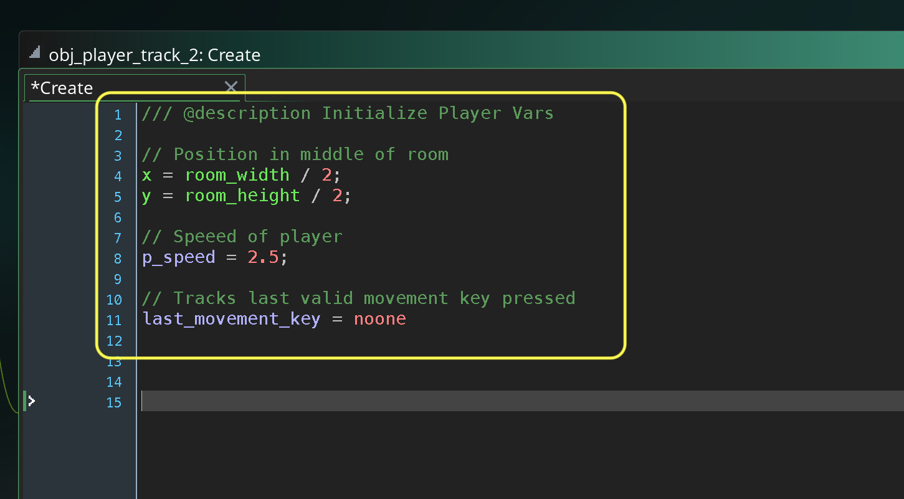
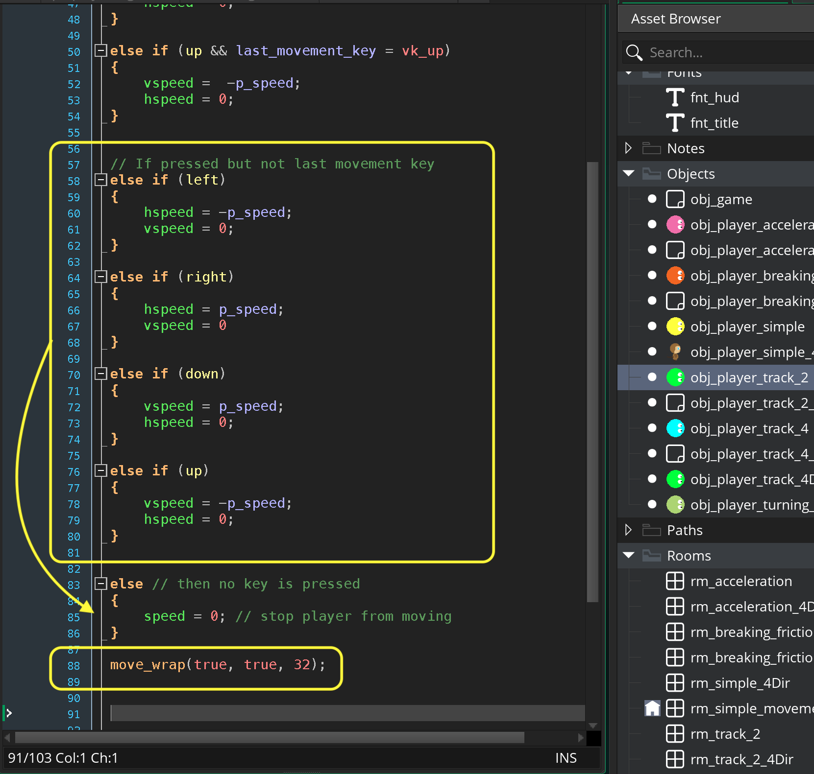
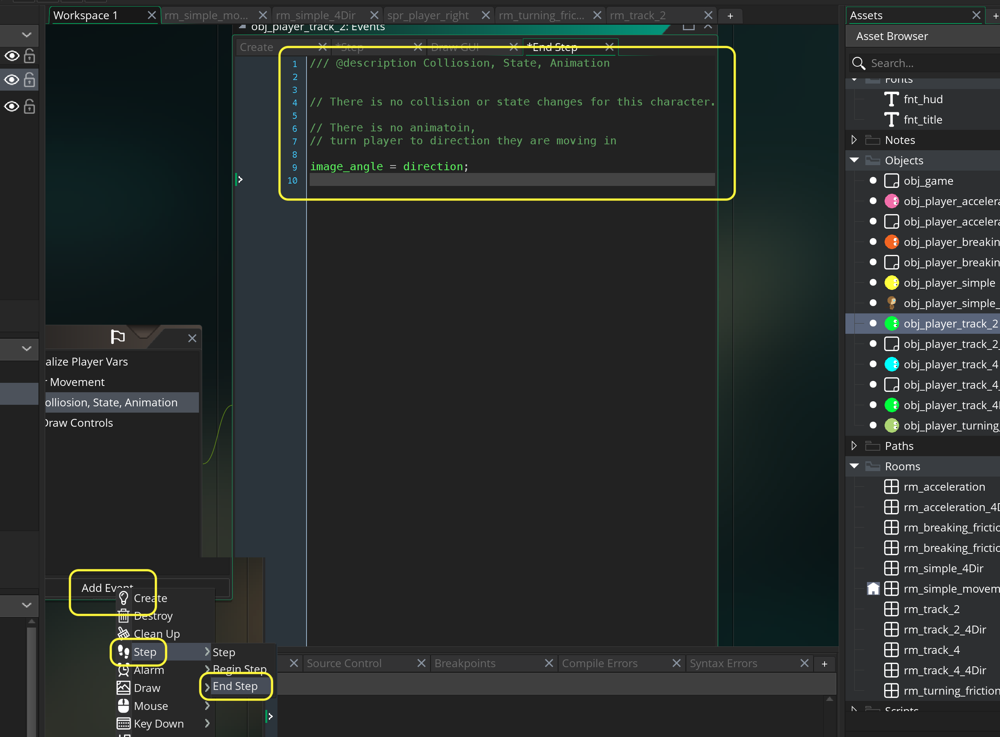
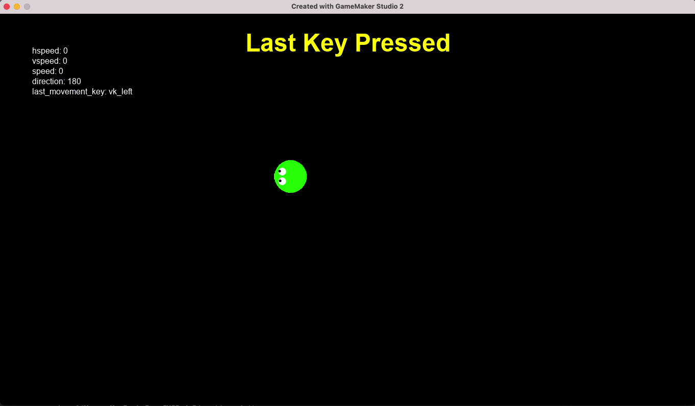

### Last Key Pressed

[previous](../simple-movement/README.md#user-content-simple-movement-in-4-directions) • [home](../README.md#user-content-gms2-move-in-4-directions) • [next](../)

Now we will take into account which key was the last valid movement key pressed.  This way if a player has a direction selected, then presses a new direction it goes in that direction regardless of the order of the keys pressed.  This is a slighly more sophisticated implementation than the [simple movement](../simple-movement/README.md#user-content-simple-movement-in-4-directions).

 

---

##### `Step 1.`\|`4DIR`|:small_blue_diamond:

Create a sprite called `spr_player` (I have called mine sp_player_2 as I have it in a single project with the simple implemtation).  Press the <kbd>Edit Image</kbd> button and draw a player and pick a color for it.  Change the **Origin** to `Middle | Center`.

##### `Step 2.`\|`4DIR`|:small_blue_diamond: :small_blue_diamond: 

*Right click* on **Objects** and select **New | Object** and name it `obj_player_track_2`. Set the **Sprite** to `spr_player`.

##### `Step 3.`\|`4DIR`|:small_blue_diamond: :small_blue_diamond: :small_blue_diamond:

In **obj_player_track_2** press the <kbd>Add Event</kbd> and select a **Create** event.

* Center the sprite in the room
* Add a variable to track the speed of the player in pixels per step called `p_speed`
* Add a variable to store the last valid movement button pressed called `last_movement_key`

##### `Step 4.`\|`4DIR`|:small_blue_diamond: :small_blue_diamond: :small_blue_diamond: :small_blue_diamond:

If you don't have the two fonts from the last exercise *Right click* on **Fonts** and select **New | Font** and name it `fnt_title`. Make the **Size** `36` and the **Style** `Bold`.

Add another font called `fnt_hud` with a **Size** of `12` and **Style** `Regular`.

##### `Step 5.`\|`4DIR`| :small_orange_diamond:

If you don't already have an **obj_game** *right click* on **Objects** and select **New | Object** and name it `obj_game`. Set **Persistent** to `true`. Press the <kbd>Add Event</kbd> and select a **Draw | Draw GUI** event.

* Set the font to **fnt_title**
* Center the text alignment
* Set the color to yellow
* Set up a temporary variable called `title`
* Switch on the room and set the **title** to `"Last Key Pressed"`
* Draw title

Don't include the `case rm_simple_movement:` if you do NOT have this room. Only include this if you have done the previous exercise.

##### `Step 6.`\|`4DIR`| :small_orange_diamond: :small_blue_diamond:

Open up **obj_game**. Press the <kbd>Add Event</kbd> and select a **Step | Step** event. Only add this if you want to switch between rooms with the different implementations of the 4 way movement.  

* Check if space is pressed and if there is another room to go to
* If so, then go to next room
* Else if space is pressed, go back to first room (if it exists)

##### `Step 7.`\|`4DIR`| :small_orange_diamond: :small_blue_diamond: :small_blue_diamond:

*Right click* on **Rooms** and select **New | Room** and name it `rm_track_2`. Change the **Room Order** to place this room on the top of the list or you can leave it in order and press the <kbd>Space Bar</kbd> to change rooms if you have done the previous exercise and added the **Step** event to **obj_game**.

Draw  copy of **obj_player_track_2** and **obj_game** to the level.

##### `Step 8.`\|`4DIR`| :small_orange_diamond: :small_blue_diamond: :small_blue_diamond: :small_blue_diamond:

Now *press* the <kbd>Play</kbd> button in the top menu bar to launch the game. Now if you implemented the **obj_game** you can press the <kbd>Space Bar</kbd> to switch rooms.  The room title changes and we have our **Last Key Pressed** title and our green player.

##### `Step 9.`\|`4DIR`| :small_orange_diamond: :small_blue_diamond: :small_blue_diamond: :small_blue_diamond: :small_blue_diamond:

Now lets print out the last movement key pressed to make sure it works. Press the <kbd>Add Event</kbd> and select a **Draw | Draw GUI** event. 

* Left align the text
* Set the color of the font to white
* Change to font hud
* Create a temporary variable that stores the last key pressed
* Switch to print which key is in the `last_key` variable
* Print `hspeed`, `vspeed`, `speed`, `dreciton` and `last_movement_key`

##### `Step 10.`\|`4DIR`| :large_blue_diamond:

Now lets store the key presses in shorter variables so we can access the keys quicker than typing in the `keyboard_check(key)` every time.  We will store them in 4 temporary variables, `left`, `right`, `down` and `up`.

We will use the **[keyboard_lastkey](https://manual.yoyogames.com/GameMaker_Language/GML_Reference/Game_Input/Keyboard_Input/keyboard_lastkey.htm)** variable that **GameMaker** updates.

> This variable refers to the value that keyboard_key was in the previous frame, returning the keycode of that key (all standard keycode constants are returned). - GameMake Manual

Now we only want to read the variable if a valid movement key is pressed so we check to see if **keyboard_lastkey** contains `vk_left`, `vk_right`, `vk_up` or `vk_down`.

##### `Step 11.`\|`4DIR`| :large_blue_diamond: :small_blue_diamond: 

Now *press* the <kbd>Play</kbd> button in the top menu bar to launch the game. Now you will notice that the **last_movement_key** will only update if you press one of the movement keys you have defined.  This keeps other key presses out of this buffer.

https://user-images.githubusercontent.com/5504953/140608341-46f26ec4-6428-4a3a-b890-ec47c53c9141.mp4

##### `Step 12.`\|`4DIR`| :large_blue_diamond: :small_blue_diamond: :small_blue_diamond: 

Press the <kbd>Add Event</kbd> and select a **Step | Step** event.

Now the only difference we make to the first simple implementation is that we look for both the key being pressed as well as the last movement key being pressed.  So it wil only move if the button is pressed **and** if it was the last key pressed.  We end with stopping the player if no movement button is the last key pressed. We will also add a **move_wrap()** to ensure the player doesn't leave the screen.

##### `Step 13.`\|`4DIR`| :large_blue_diamond: :small_blue_diamond: :small_blue_diamond:  :small_blue_diamond: 

Now *press* the <kbd>Play</kbd> button in the top menu bar to launch the game. Now it works more consistently than the previous implementation.  It always needs to be the last movement button pressed.  But it stops me from pressing another button quickly then letting go as the remaining button press is no longer last and the player will stop.  I think we can do better.

https://user-images.githubusercontent.com/5504953/140608342-c88e8114-d940-4cc6-b900-feb06613bd90.mp4

##### `Step 14.`\|`4DIR`| :large_blue_diamond: :small_blue_diamond: :small_blue_diamond: :small_blue_diamond:  :small_blue_diamond: 

So what we can do to allow a consistent two button behavior is to inject the old logic and check for a pressed key if all the last key checks fail.  So before the final `else` add a check to see if a button is held.

##### `Step 15.`\|`4DIR`| :large_blue_diamond: :small_orange_diamond: 

Now *press* the <kbd>Play</kbd> button in the top menu bar to launch the game. Now when you press a second button while holding the first and release it the player still moves.  This works consistently in all directions with all two button combinations. 

https://user-images.githubusercontent.com/5504953/140608731-4e75a7f7-ca86-4d82-a58c-a826ddf56499.mp4

##### `Step 16.`\|`4DIR`| :large_blue_diamond: :small_orange_diamond:   :small_blue_diamond: 

Now *press* the <kbd>Play</kbd> button in the top menu bar to launch the game. Press and hold in this order <kbd>Left</kbd> -> <kbd>Down</kbd> -> <kbd>Right</kbd>.  Now let go of the keys in reverse order.  The game goes from going right to going left as opposed to going down the second last key pressed.  Now for some this might be acceptible.  Because we have pushed the inconsistent key outcome to the third key pressed which is much less likely to happen.

##### `Step 17.`\|`4DIR`| :large_blue_diamond: :small_orange_diamond: :small_blue_diamond: :small_blue_diamond:

Now the final element we will implement is the direction the player is facing in. Now instead of putting it in the step event it is a good idea to put it in an **end step** event.  This is because if we were to do collision detection (move the player outside of an area that they are not supposed to enter) this needs to be done **after** the player moves. When using `speed`, `hspeed` or `vspeed` the player only gets updated to their new position **after** the **step | step** event has run but *before* the **step | end step**.  This means that if we were to check for a player entering an area they shouldn't have, this would need to be done in the end step.

Press the <kbd>Add Event</kbd> and select a **Step | End Step** event. Now make the player face the direction they are moving in.

##### `Step 18.`\|`4DIR`| :large_blue_diamond: :small_orange_diamond: :small_blue_diamond: :small_blue_diamond: :small_blue_diamond:

Now *press* the <kbd>Play</kbd> button in the top menu bar to launch the game. Now your player faces the correct direction and you have consistent controls tracking two buttons.

##### `Step 19.`\|`4DIR`| :large_blue_diamond: :small_orange_diamond: :small_blue_diamond: :small_blue_diamond: :small_blue_diamond: :small_blue_diamond:

Select the **File | Save Project** then press **File | Quit** to make sure everything in the game is saved. If you are using **GitHub** open up **GitHub Desktop** and add a title and longer description (if necessary) and press the <kbd>Commit to main</kbd> button. Finish by pressing **Push origin** to update the server with the latest changes.

___

| [previous](../simple-movement/README.md#user-content-simple-movement-in-4-directions)| [home](../README.md#user-content-gms2-move-in-4-directions) | [next](../)|
|---|---|---|
