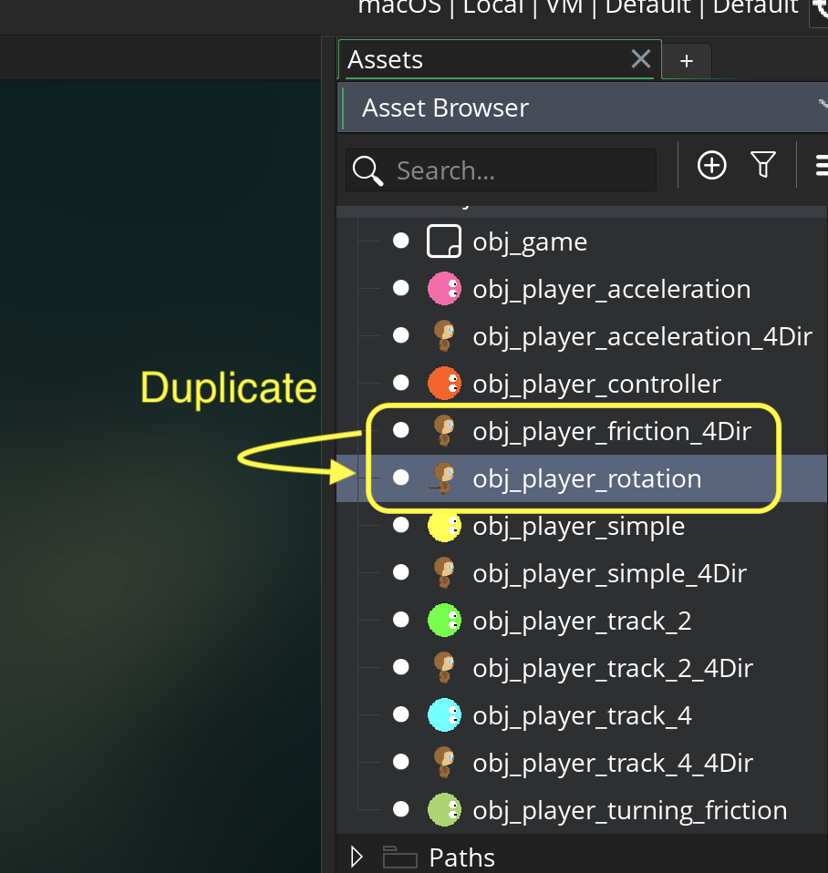
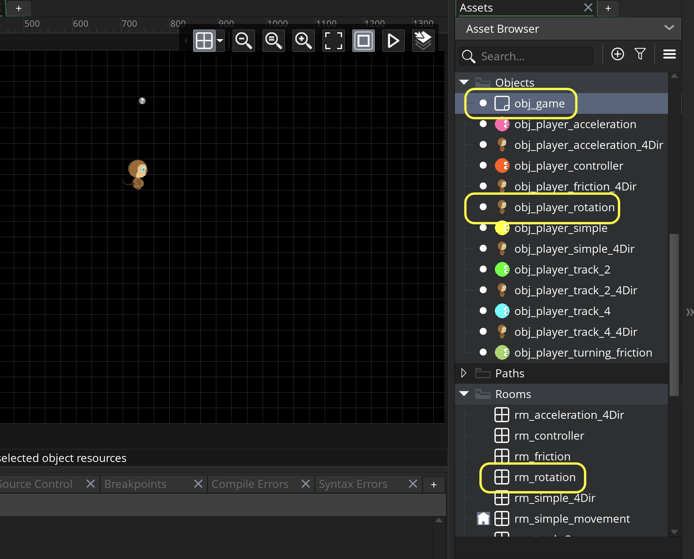
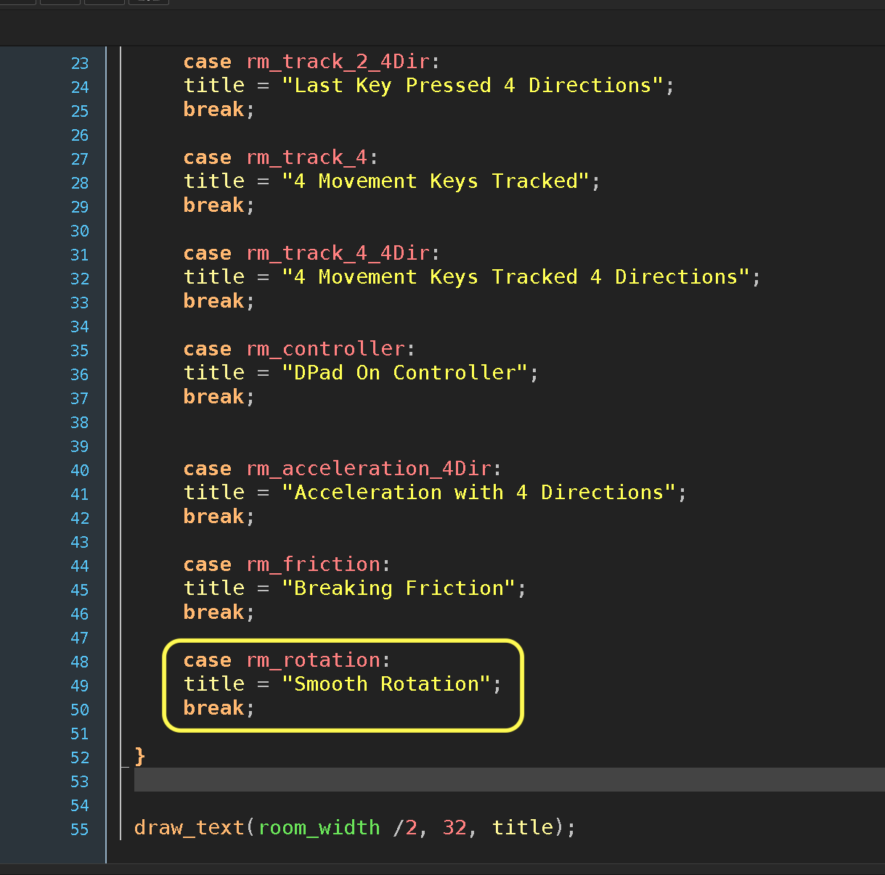
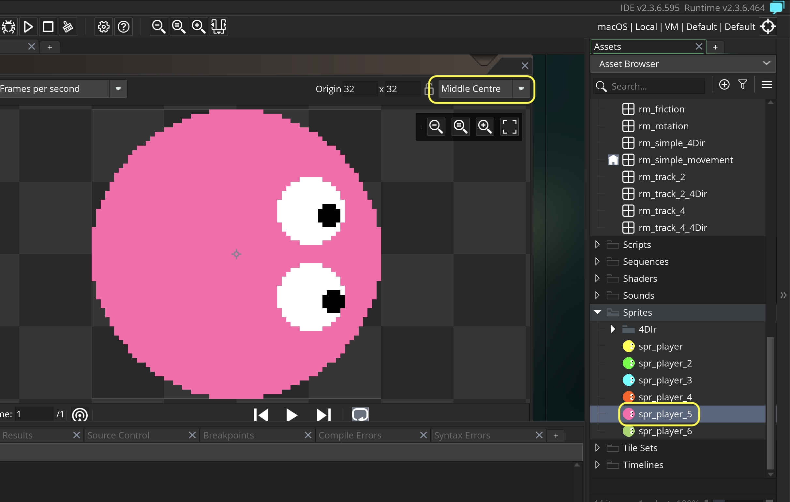
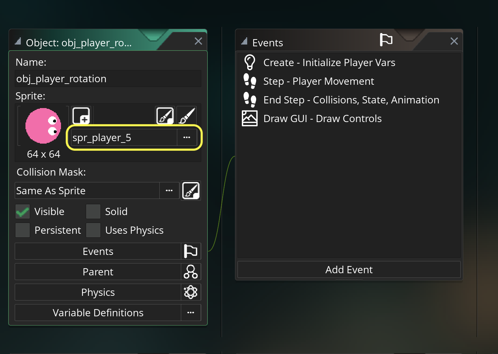
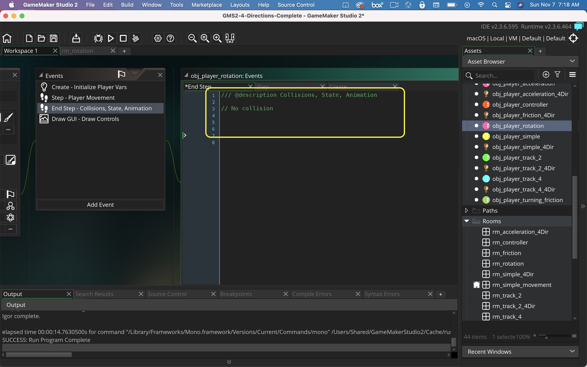
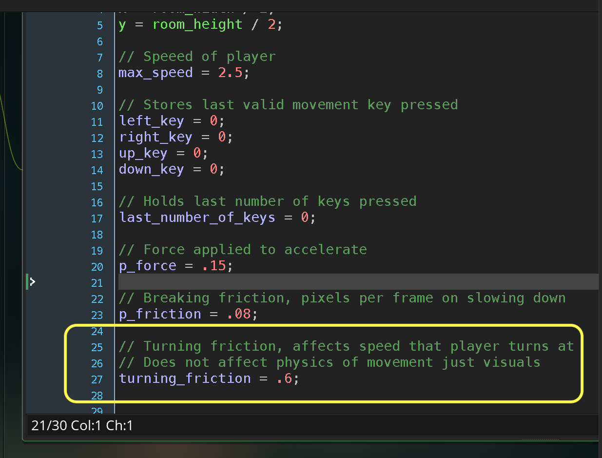
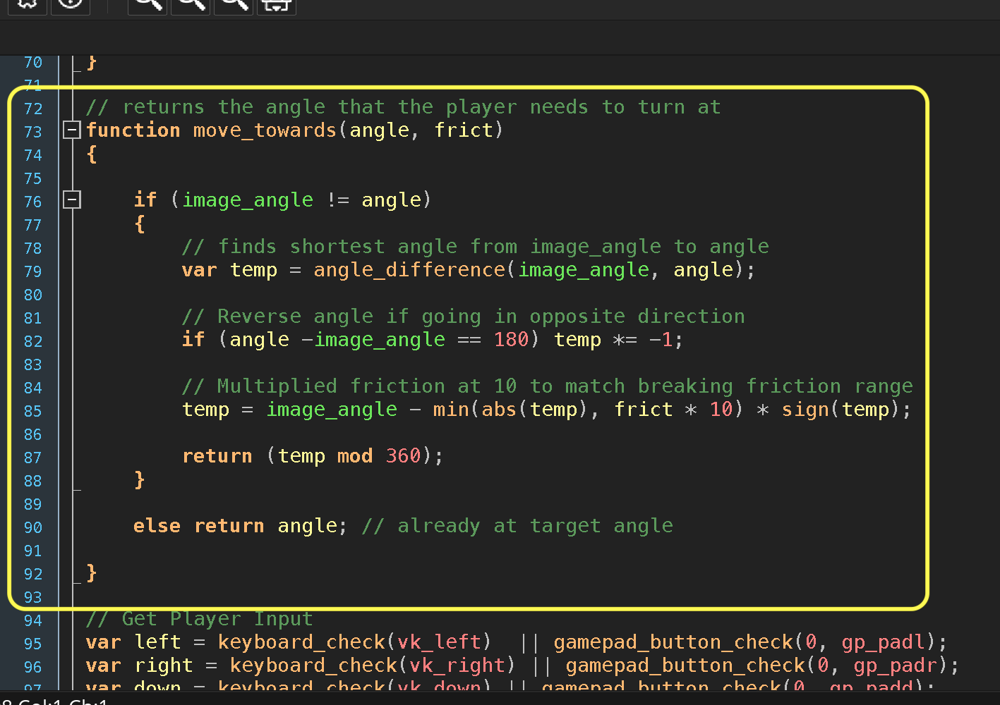
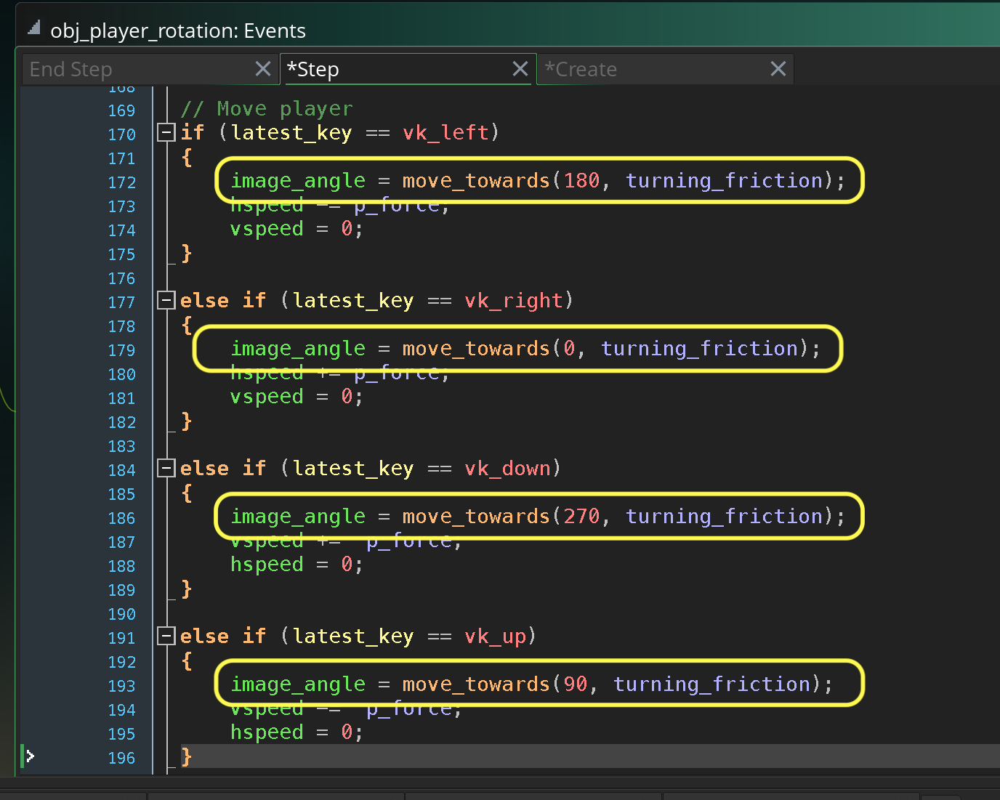
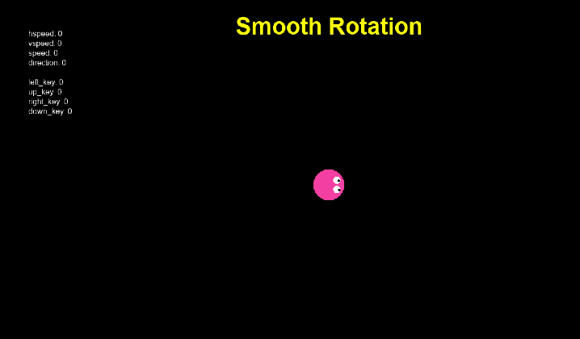

### Rotate Top Down Animation

<sub>[previous](../friction/README.md#user-content-breaking-friction) • [home](../README.md#user-content-gms2-move-in-4-directions)</sub>


For top down animation it would be nice to rotate the animation to place so the player moves smoothly between animations.

<br>

---


##### `Step 1.`\|`4DIR`|:small_blue_diamond:

Complete the [Breaking Friction](friction/README.md#user-content-breaking-friction) walk through.  We will use this as our starting off point, go back to a top down sprite then rotate it smoothly. 

Duplicate **obj_player_friction_4Dir** and name the object `obj_player_rotation`.




##### `Step 2.`\|`4DIR`|:small_blue_diamond: :small_blue_diamond: 

*Right click* on **Rooms** and select **New | Room** and name it `rm_rotation`. Change the **Room Order** to place this room on the top of the list or use the space bar.

*Drag and drop* **obj_game** and **obj_player_rotation** into the level.




##### `Step 3.`\|`4DIR`|:small_blue_diamond: :small_blue_diamond: :small_blue_diamond:

Go to **obj_game | Draw GUI** and add a title for this level.




##### `Step 4.`\|`4DIR`|:small_blue_diamond: :small_blue_diamond: :small_blue_diamond: :small_blue_diamond:

Now we will be adding rotation to a top down character without different angles of animation.  Create a new **Sprite** and call it `spr_player`.  Press the <kbdd>Edit Image</kbd> button and create a top down view.  Make sure the **Origin** is set to `Middle Center`.




##### `Step 5.`\|`4DIR`| :small_orange_diamond:

Open up **obj_player_rotation** and assign the above sprite to it.




##### `Step 6.`\|`4DIR`| :small_orange_diamond: :small_blue_diamond:

Open up **obj_player_rotation | End Step** and delete its contents.  We will not be switching animations in the end step.




##### `Step 7.`\|`4DIR`| :small_orange_diamond: :small_blue_diamond: :small_blue_diamond:

Now open up **obj_player_rotation | Create** and add a `turning_friction` variable and set it to `.8`.  This will be used the adjust the speed of how fast the player rotates from its current position to its target.  Please note that this will not affect the physics.  The player's movement will not be affected at all and this is purely visual.




##### `Step 8.`\|`4DIR`| :small_orange_diamond: :small_blue_diamond: :small_blue_diamond: :small_blue_diamond:

Lets add a new function called `move_towards(angle, frict)`.  **angle** is the angle we would like to change to and **frict** is the speed we get there.  The lower the number, the slower we turn, the larger the number the faster we turn.

First we check to see that we are not already pointing in the correct direciton.  If we are we just return the angle unchanged.  If not:

```
var temp = angle_difference(image_angle, angle);
```

We need to find the fastest route between two angles,  So if the angle is 90° apart, we not want to rotate -270° we want to take the shortest route either clockwise or counter clockwise.  This is what the **angle_difference(image_anlge, angle)** function returns the quickest angle to our desitation!

```
if (angle - image_angle == 180) temp *= -1;
```
This is done so that the image flips rotation when moving positive 180 degrees.  It looks a git better to my eyes, but is not absolutely necessary.

```
temp = image_angle - min(abs(temp), frict * 10) * sign(temp);
```

This is not as complicated as it looks.  Now our **temp** target could be positive or negative.  So we need to subtract from our image_anlge a positive **temp**.  This is what **abs()** does, it removes the sign.  Now for the last step it will overshoot the target if the difference isn't precise.  So we take the smallet mumber the temp, or frict * 10 to get precisely to the target.  We then multiply it by `-1` or `1` which is what **sign(temp)** does.

We return the final degree in angles and **mod** it by 360 which keeps the range from -360 to 360.




##### `Step 9.`\|`4DIR`| :small_orange_diamond: :small_blue_diamond: :small_blue_diamond: :small_blue_diamond: :small_blue_diamond:

Now further down the **step** event we will call this function with the desired target angle as well as the speed to get there in all four directions.




##### `Step 10.`\|`4DIR`| :large_blue_diamond:

Now *press* the <kbd>Play</kbd> button in the top menu bar to launch the game. Now you will see that the player smoothly animates between positions.




##### `Step 11.`\|`4DIR`| :large_blue_diamond: :small_blue_diamond: 

Select the **File | Save Project** then press **File | Quit** to make sure everything in the game is saved. If you are using **GitHub** open up **GitHub Desktop** and add a title and longer description (if necessary) and press the <kbd>Commit to main</kbd> button. Finish by pressing **Push origin** to update the server with the latest changes.


___


| [previous](../friction/README.md#user-content-breaking-friction)| [home](../README.md#user-content-gms2-move-in-4-directions) |
|---|---|
