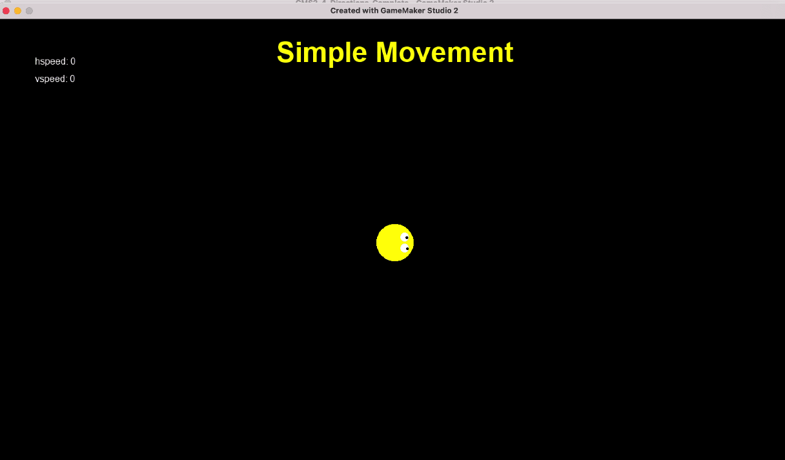

### Simple Movement with Animated Player

[previous](../simple-movement/README.md#user-content-simple-movement-in-4-directions) • [home](../README.md#user-content-gms2-move-in-4-directions) • [next](../)

Now we will take into account which key was the last valid movement key pressed.  This way if a player has a direction selected, then presses a new direction it goes in that direction regardless of the order of the keys pressed.  This is a slighly more sophisticated implementation than the [simple movement](../simple-movement/README.md#user-content-simple-movement-in-4-directions).

 

---

##### `Step 1.`\|`4DIR`|:small_blue_diamond:

Create a sprite called `spr_player` (I have called mine sp_player_2 as I have it in a single project with the simple implemtation).  Press the <kbd>Edit Image</kbd> button and draw a player and pick a color for it.  Change the **Origin** to `Middle | Center`.

##### `Step 2.`\|`4DIR`|:small_blue_diamond: :small_blue_diamond: 

*Right click* on **Objects** and select **New | Object** and name it `obj_player_track_2`. Set the **Sprite** to `spr_player`.

##### `Step 3.`\|`4DIR`|:small_blue_diamond: :small_blue_diamond: :small_blue_diamond:

In **obj_player_track_2** press the <kbd>Add Event</kbd> and select a **Create** event.

* Center the sprite in the room
* Add a variable to track the speed of the player in pixels per step called `p_speed`
* Add a variable to store the last valid movement button pressed called `last_movement_key`

##### `Step 4.`\|`4DIR`|:small_blue_diamond: :small_blue_diamond: :small_blue_diamond: :small_blue_diamond:

If you don't have one from the last exercise *Right click* on **Fonts** and select **New | Font** and name it `fnt_title`. Make the **Size** `36` and the **Style** `Bold`.

##### `Step 5.`\|`4DIR`| :small_orange_diamond:

If you don't already have an **obj_game** *right click* on **Objects** and select **New | Object** and name it `obj_game`. Set **Persistent** to `true`. Press the <kbd>Add Event</kbd> and select a **Draw | Draw GUI** event.

* Set the font to **fnt_title**
* Center the text alignment
* Set the color to yellow
* Set up a temporary variable called `title`
* Switch on the room and set the **title** to `"Last Key Pressed"`
* Draw title

Don't include the `case rm_simple_movement:` if you do NOT have this room. Only include this if you have done the previous exercise.

##### `Step 6.`\|`4DIR`| :small_orange_diamond: :small_blue_diamond:

Open up **obj_game**. Press the <kbd>Add Event</kbd> and select a **Step | Step** event. Only add this if you want to switch between rooms with the different implementations of the 4 way movement.  

* Check if space is pressed and if there is another room to go to
* If so, then go to next room
* Else if space is pressed, go back to first room (if it exists)

##### `Step 7.`\|`4DIR`| :small_orange_diamond: :small_blue_diamond: :small_blue_diamond:

*Right click* on **Rooms** and select **New | Room** and name it `rm_track_2`. Change the **Room Order** to place this room on the top of the list or you can leave it in order and press the <kbd>Space Bar</kbd> to change rooms if you have done the previous exercise and added the **Step** event to **obj_game**.

Draw  copy of **obj_player_track_2** and **obj_game** to the level.

##### `Step 8.`\|`4DIR`| :small_orange_diamond: :small_blue_diamond: :small_blue_diamond: :small_blue_diamond:

Now *press* the <kbd>Play</kbd> button in the top menu bar to launch the game. Now if you implemented the **obj_game** you can press the <kbd>Space Bar</kbd> to switch rooms.  The room title changes and we have our **Last Key Pressed** title and our green player.

##### `Step 9.`\|`4DIR`| :small_orange_diamond: :small_blue_diamond: :small_blue_diamond: :small_blue_diamond: :small_blue_diamond:

##### `Step 10.`\|`4DIR`| :large_blue_diamond:

##### `Step 11.`\|`4DIR`| :large_blue_diamond: :small_blue_diamond: 

##### `Step 12.`\|`4DIR`| :large_blue_diamond: :small_blue_diamond: :small_blue_diamond: 

##### `Step 13.`\|`4DIR`| :large_blue_diamond: :small_blue_diamond: :small_blue_diamond:  :small_blue_diamond: 

##### `Step 14.`\|`4DIR`| :large_blue_diamond: :small_blue_diamond: :small_blue_diamond: :small_blue_diamond:  :small_blue_diamond: 

##### `Step 15.`\|`4DIR`| :large_blue_diamond: :small_orange_diamond: 

##### `Step 16.`\|`4DIR`| :large_blue_diamond: :small_orange_diamond:   :small_blue_diamond: 

##### `Step 17.`\|`4DIR`| :large_blue_diamond: :small_orange_diamond: :small_blue_diamond: :small_blue_diamond:

##### `Step 18.`\|`4DIR`| :large_blue_diamond: :small_orange_diamond: :small_blue_diamond: :small_blue_diamond: :small_blue_diamond:

##### `Step 19.`\|`4DIR`| :large_blue_diamond: :small_orange_diamond: :small_blue_diamond: :small_blue_diamond: :small_blue_diamond: :small_blue_diamond:

##### `Step 20.`\|`4DIR`| :large_blue_diamond: :large_blue_diamond:

##### `Step 21.`\|`4DIR`| :large_blue_diamond: :large_blue_diamond: :small_blue_diamond:

___

| [previous](../simple-movement/README.md#user-content-simple-movement-in-4-directions)| [home](../README.md#user-content-gms2-move-in-4-directions) | [next](../)|
|---|---|---|
