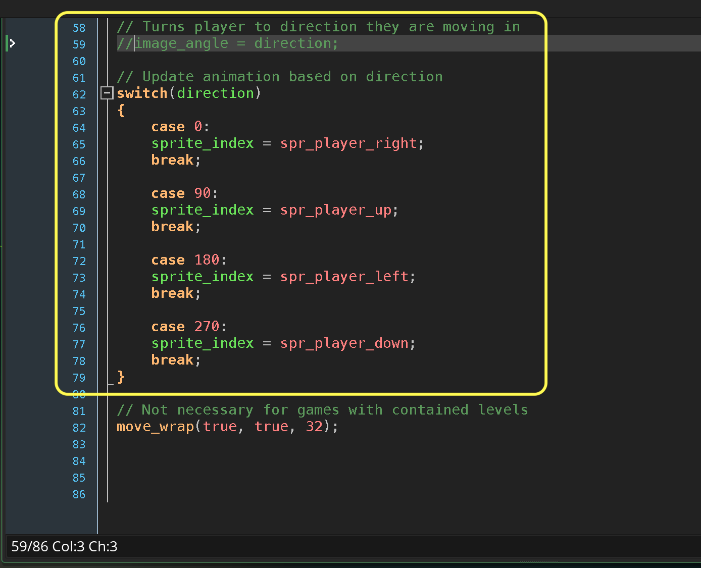
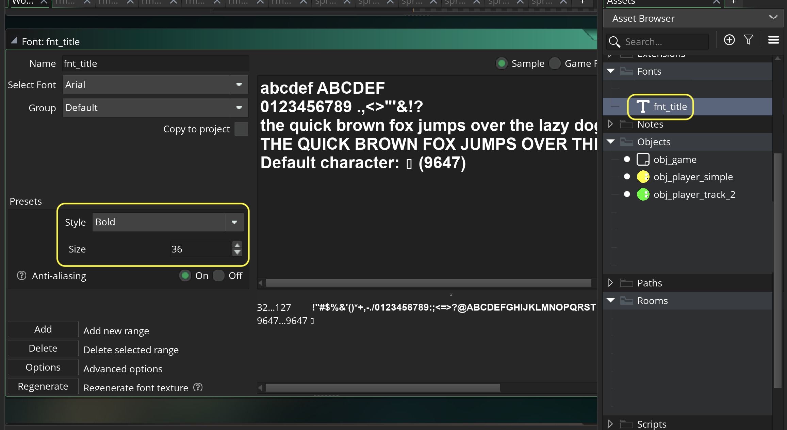
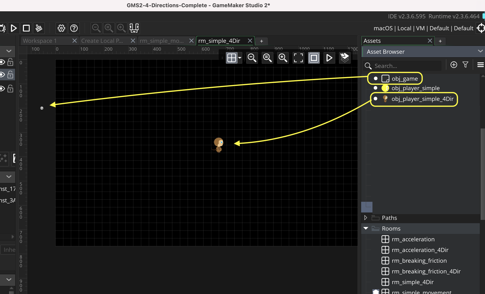

### Simple Movement with Animated Player

<sub>[previous](../simple-movement/README.md#user-content-simple-movement) • [home](../README.md#user-content-gms2-move-in-4-directions) • [next](../last-key/README.md#user-content-last-key-pressed)</sub>


Now lets use a sprite that animates with 4 directions.  So we will not ritate a single sprite but run 4 sprites, one for each direction.

<br>

---


##### `Step 1.`\|`4DIR`|:small_blue_diamond:

Download the [player sprites](../Assets/4DirectionAnimations.yymps). Go back to **GameMaker** and make sure you have an existing [GML Project](https://github.com/maubanel/GMS2-Snippets/blob/main/rename-project/README.md#user-content-rename-gms2-project).

Go back to **GameMaker** and press **Tools | Import Local Package**.


##### `Step 2.`\|`4DIR`|:small_blue_diamond: :small_blue_diamond: 

Select the package you just downloaded **4DirectionAnimations.yymps**.  Select the **Sprites** folder and press the <kbd>Add All</kbd> button.  This will move the contents of the folder with 4 animations to the right.  Press the <kbd>Import</kbd> button to import the animations.


##### `Step 3.`\|`4DIR`|:small_blue_diamond: :small_blue_diamond: :small_blue_diamond:

This will import 4 animations to the **Sprites | 4Dir** folder.  You will have **spr_player_left**, **spr_player_right**, **spr_player_up** and **spr_player_down**.


##### `Step 4.`\|`4DIR`|:small_blue_diamond: :small_blue_diamond: :small_blue_diamond: :small_blue_diamond:

Open up the animation and press the <kbd>Run Animation</kbd> button. You will see the player animates in four directions.


https://user-images.githubusercontent.com/5504953/140513262-69545b68-f6f7-44f0-9309-b18ce07ce8a6.mp4


##### `Step 5.`\|`4DIR`| :small_orange_diamond:

If you have completed the previous Simple Movement walk through you can duplicate the **obj_player** object.  Or you can right click on **Objects** and select **Create | Object**.  Name it `obj_player_simple_4dir`.  Complete the [Simple Movement Walkthrough](../simple-movement/README.md#user-content-simple-movement).  


##### `Step 6.`\|`4DIR`| :small_orange_diamond: :small_blue_diamond:

We are not rotating the sprite but switching between animated sprites in the four needed directions.  You can delete or comment out `image_angle = direction;`.  Now we will be using a **[switch](https://manual.yoyogames.com/GameMaker_Language/GML_Overview/Language_Features/switch.htm)** statement.

> In a number of situations you want to let your instances complete different actions depending on a particular value. You can do this using a number of consecutive if / else statements, but when the possible choices gets above two or three it is usually easier to use the switch statement. A switch statement has the following form:

```
switch (<expression>)
{
    case <constant1>: <statement1>; ... ; break;
    case <constant2>: <statement2>; ... ; break;
    ...
    default: <statement>;
}
```

> This works as follows:<br><br>1. First the expression is executed.
Next it is compared with the results of the different constants after each of the case statements. When we say "constant" what we mean is that the value in the case cannot be a variable expression and must be a fixed value of any data type, like "fight" or 3 or the keyword noone.<br><br>2.The execution continues after the first case statement with the correct value, until a break statement is encountered.<br><br>3.If no case statement has the right value, then the default statement will be executed (it is not required to have a default statement, and if none is supplied then no action will be taken). - GameMaker Manual

So in this case we will be switching on `direction` when it is at 0° (East), 90° (North), 180° (West) and 270° (South).




##### `Step 7.`\|`4DIR`| :small_orange_diamond: :small_blue_diamond: :small_blue_diamond:

If you don't have one from the last exercise *Right click* on **Fonts** and select **New | Font** and name it `fnt_title`. Make the **Size** `36` and the **Style** `Bold`.




##### `Step 8.`\|`4DIR`| :small_orange_diamond: :small_blue_diamond: :small_blue_diamond: :small_blue_diamond:

*Right click* on **Rooms** and select **New | Room** and name it `rm_simple_4Dir`. Change the **Room Order** to place this room on the top of the list or you can leave it in order and press the <kbd>Space Bar</kbd> to change rooms if you have done the previous exercise and added the **Step** event to **obj_game**.

Drag and drop acopy of **obj_player** (**obj_player_simple_4Dir**) and **obj_game** to the level.




##### `Step 9.`\|`4DIR`| :small_orange_diamond: :small_blue_diamond: :small_blue_diamond: :small_blue_diamond: :small_blue_diamond:

If you don't already have an **obj_game** *right click* on **Objects** and select **New | Object** and name it `obj_game`. Press the <kbd>Add Event</kbd> and select a **Draw | Draw GUI** event.

* Set the font to **fnt_title**
* Center the text alignment
* Set the color to yellow
* Set up a temporary variable called `title`
* Switch on the room and set the **title** to `"Last Key Pressed"`
* Draw title

Don't include the `case rm_simple_movement:` if you do NOT have this room. Only include this if you have done the previous exercise.


##### `Step 10.`\|`4DIR`| :large_blue_diamond:

If you do have multiple rooms you need a way to switch between them.  Only do the below if you want to switch rooms with the <kbd>Spacebar</kbd>.

Open up **obj_game**. Press the <kbd>Add Event</kbd> and select a **Step | Step** event. Only add this if you want to switch between rooms with the different implementations of the 4 way movement.  

* Check if space is pressed and if there is another room to go to
* If so, then go to next room
* Else if space is pressed, go back to first room (if it exists)


##### `Step 11.`\|`4DIR`| :large_blue_diamond: :small_blue_diamond: 

Now *press* the <kbd>Play</kbd> button in the top menu bar to launch the game. Now if you implemented the **obj_game** you can press the <kbd>Space Bar</kbd> to switch rooms.  Now we switch between animations but if we stop the player animation still runs.

https://user-images.githubusercontent.com/5504953/140519058-3c1d5827-61da-40dd-a347-d78207974ec6.mp4


##### `Step 12.`\|`4DIR`| :large_blue_diamond: :small_blue_diamond: :small_blue_diamond: 

Open up all four animations and press the <kbd>Edit Image</kbd> button.  You will notice that on the third frame is the one where both feet are on the ground.  We will use this frame as our **idle**.  We will use **[image_index](https://manual.yoyogames.com/GameMaker_Language/GML_Reference/Asset_Management/Sprites/Sprite_Instance_Variables/image_index.htm)** to pick this frame and **[image_speed](https://manual.yoyogames.com/GameMaker_Language/GML_Reference/Asset_Management/Sprites/Sprite_Instance_Variables/image_speed.htm)** to start and stop the animation.

> The image_speed variable determines the speed in which GameMaker Studio 2 will cycle through the sub-images for the current instance sprite. The speed value given is a multiplier, with 1 being the default value, and setting it to 0.5 will half the animation speed - as set in the Sprite Editor or Image Editor - GameMaker Manual

So when the player is not moving we will set the `image_speed = 0` and when they are moving set it to `1`.

For `image_index`, the frame count starts at `0` so the third frame will be set as the number `2` (0, 1, 2).


##### `Step 13.`\|`4DIR`| :large_blue_diamond: :small_blue_diamond: :small_blue_diamond:  :small_blue_diamond: 

Now add before the switch statement:

* If player is moving set `image_speed` to `1`.
* else if player is not moving set `image_speed` to `0` and `image_index` to `2`.


##### `Step 14.`\|`4DIR`| :large_blue_diamond: :small_blue_diamond: :small_blue_diamond: :small_blue_diamond:  :small_blue_diamond: 

Now *press* the <kbd>Play</kbd> button in the top menu bar to launch the game. Player now stops when idling and starts animating again when moving.  We get the desired effect.  We still have the same control problem with inconsistent key results that we had in the previous exercise.
https://user-images.githubusercontent.com/5504953/140521388-a7d77d02-f72b-4186-923d-c391641f74e6.mp4


##### `Step 15.`\|`4DIR`| :large_blue_diamond: :small_orange_diamond: 

Select the **File | Save Project** then press **File | Quit** to make sure everything in the game is saved. If you are using **GitHub** open up **GitHub Desktop** and add a title and longer description (if necessary) and press the <kbd>Commit to main</kbd> button. Finish by pressing **Push origin** to update the server with the latest changes.


___


| [previous](../simple-movement/README.md#user-content-simple-movement)| [home](../README.md#user-content-gms2-move-in-4-directions) | [next](../last-key/README.md#user-content-last-key-pressed)|
|---|---|---|
