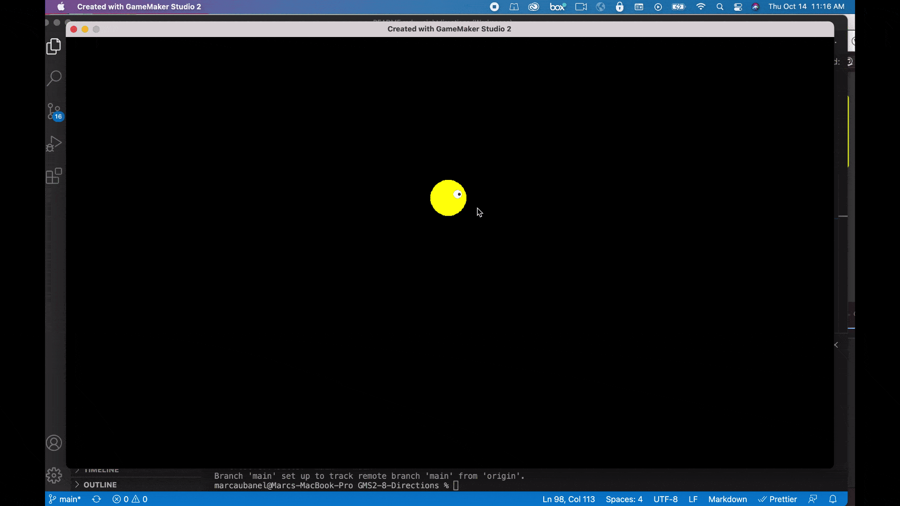
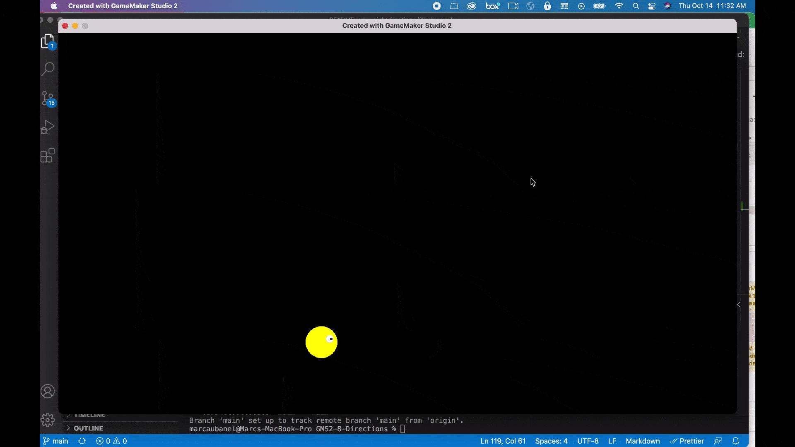

### Simple Movement in 4 Directions

[previous](../) • [home](../README.md#user-content-gms2-move-in-4-directions) • [next](../)

For moving in four directions we will look at each direction seperately and move either up,down, left or right.  Lets begin with the simplest implementation.

 

---

##### `Step 1.`\|`MI8D`|:small_blue_diamond:

Create a new level by right clicking on **Rooms** and select **Create | Room** and call it `rm_simple_movement`.  Open up **Room Order** and *drag* it to the top of the list if you have other rooms in your project.

##### `Step 2.`\|`FHIU`|:small_blue_diamond: :small_blue_diamond: 

Now lets create a sprite for our player that we will be moving.  We will create an eyeball so we can see the direction we are moving in. Right click on **Sprites** and select **Create | Sprite** and call it `spr_player`.  Now press the <kbd>Edit Image</kbd> button to go to the editor.  Select the **Circle tool** and the yellow color and draw a round circle to fill the sprite,  Add an eyeball pointing the right (0 degrees) so that we have the player oriented in our starting direction.

##### `Step 3.`\|`MI8D`|:small_blue_diamond: :small_blue_diamond: :small_blue_diamond:

*Right click* on **Objects** and select **Create | Object** and name it `obj_player_simple`.  Assign sprite `spr_player` by pressing **Sprite** and selecting the sprite.

##### `Step 4.`\|`MI8D`|:small_blue_diamond: :small_blue_diamond: :small_blue_diamond: :small_blue_diamond:

Press the <kbd>Add Event</kbd> and add a **Create** and center the object in the dead center of the room.

##### `Step 5.`\|`MI8D`| :small_orange_diamond:

Open up **rm_simple_movement** and drag and drop a **obj_player_simple** into the level. Now *press* the <kbd>Play</kbd> button in the top menu bar to launch the game.

##### `Step 6.`\|`MI8D`| :small_orange_diamond: :small_blue_diamond:

Open up **obj_player** and press the <kbd>Add Event</kbd> button and add a **Step | Step** event.  Now we will look at **[keyboard_check(key)](https://manual.yoyogames.com/GameMaker_Language/GML_Reference/Game_Input/Keyboard_Input/keyboard_check.htm)** and will check each key seperately.  

We wil be moving the player using **[vspeed](https://manual.yoyogames.com/GameMaker_Language/GML_Reference/Asset_Management/Instances/Instance_Variables/vspeed.htm)** and **[hspeed](https://manual.yoyogames.com/GameMaker_Language/GML_Reference/Asset_Management/Instances/Instance_Variables/hspeed.htm)**.

> hspeed is one of the "built in" properties that all instances have and defines the horizontal movement speed (along the x-axis) of the instance in pixels per step. So, an hspeed of 3 means 3 pixels of movement to the right (+x) every step, and an hspeed of -3 would mean 3 pixels of movement to the left (-x) every step. - GameMake Manual

> vspeed is one of the "built in" properties that all instances have and defines the vertical movement speed (along the y-axis) of the instance in pixels per step. So, a vspeed of 3 means 3 pixels of movement to the bottom (+y) every step, and a vspeed of -3 would mean 3 pixels of movement to the top (-y) every step.

If either the <kbd>left</kbd> or <kbd>right</kbd> keys are pressed then we set the `hspeed` to a positive (right) or negative (left) number.  We then set any vestigial speed in the vertical domain to `0` by setting `vspeed = 0;`. This will guarantee that we will not move diagonally.

If either the <kbd>up</kbd> or <kbd>down</kbd> keys are pressed then we set the `vspeed` to a positive (down) or negative (up) number.  We then set any vestigial speed in the horizontal domain to `0` by setting `hspeed = 0;`.

Please note that setting `hspeed = -2.5` is the same as setting the `direction = 180; speed = 2.5`.

##### `Step 7.`\|`MI8D`| :small_orange_diamond: :small_blue_diamond: :small_blue_diamond:

Now *press* the <kbd>Play</kbd> button in the top menu bar to launch the game. Now run around.  The issue is that when you let go of all the keys and player still moves around the level.

##### `Step 8.`\|`MI8D`| :small_orange_diamond: :small_blue_diamond: :small_blue_diamond: :small_blue_diamond:

So if none of the buttons are pressed we can end with an `else` since none of the buttons are pressed an just set the `speed` to `0`.

##### `Step 9.`\|`MI8D`| :small_orange_diamond: :small_blue_diamond: :small_blue_diamond: :small_blue_diamond: :small_blue_diamond:

Now *press* the <kbd>Play</kbd> button in the top menu bar to launch the game. Now when you let go you stop.  This works but the player does not face the direction they are moving in. The player can also leave the room. Lets fix that.

##### `Step 10.`\|`MI8D`| :large_blue_diamond:

Now lets have the player character look at the direction it is moving in.  Now we want the player's **[image_angle](https://manual.yoyogames.com/GameMaker_Language/GML_Reference/Asset_Management/Sprites/Sprite_Instance_Variables/image_angle.htm)** to face the direction the player is moving in.  There is a variable called **[direction](https://manual.yoyogames.com/GameMaker_Language/GML_Reference/Asset_Management/Instances/Instance_Variables/direction.htm)**. that has the angle of the speed of the player (the addition of the hspeed and vspeed).
		
> All instances in GameMaker Studio 2 have certain "built in" properties that you can use and set to govern how they look and behave. Direction is one of those properties and can be used to set the direction of movement of the instance when the instance has a speed other than 0. Note that directions in GameMaker Studio 2 are usually calculated as 0° being right, 90° being up, 180° being left and 270° being down. - GameMaker Manual

We can just set the angle of the sprite to teh direction of the movement as the player will always be facing the angle they move in.  We will also add the ability to wrap if you want this functionality.  Most games restrict leaving the level so this might not be necessary or desirable.

##### `Step 11.`\|`MI8D`| :large_blue_diamond: :small_blue_diamond: 

Now *press* the <kbd>Play</kbd> button in the top menu bar to launch the game. The next issue is that the turning of the player is not smooth.

##### `Step 12.`\|`MI8D`| :large_blue_diamond: :small_blue_diamond: :small_blue_diamond: 

The player is turning aroun the top left corner.  We want the player to turn from its center of gravity. Open up **spr_player** and change the **Origin** to `Middle | Center`.

##### `Step 13.`\|`MI8D`| :large_blue_diamond: :small_blue_diamond: :small_blue_diamond:  :small_blue_diamond: 

Now *press* the <kbd>Play</kbd> button in the top menu bar to launch the game. This is the most simple implentation of four way movement.

The problem with simple controls like this is that it doesn't take into account more cmoplex behavior.  If I am pressing the <kbd>left</kbd> key and press <kbd>down</kbd> before letting go the player will still move left until I let go.  It doesn't take into account the *latest* button pressed.  I just will either be left, right down or up in that order, that if is pressed the `if else if` chain wills stop.

##### `Step 14.`\|`MI8D`| :large_blue_diamond: :small_blue_diamond: :small_blue_diamond: :small_blue_diamond:  :small_blue_diamond: 

If all you wanted is simple movement you can stop here.  Otherwise lets add some text to halp us contextualize what we are trying to do.  

*Right click* on **Fonts** and select **New | Font** and name it `fnt_title`. Change the **Font Size** to `36` and set the **Style** it to `Bold`.

##### `Step 15.`\|`MI8D`| :large_blue_diamond: :small_orange_diamond: 

*Right click* on **Objects** and select **Create | Object** and name it `obj_game`. This will be a blank object.  Press the <kbd>Add Event</kbd> and select a **Draw | Draw GUI** event.

* Set the font to **fnt_title**.
* Center the text display.
* Set the draw color to yellow.
* Add a title called **Simple Movement**.
* Draw the title to the top center of the screen

##### `Step 16.`\|`MI8D`| :large_blue_diamond: :small_orange_diamond:   :small_blue_diamond: 

Set the **obj_game** to `Persistent` so that it goes from level to level. Drag **obj_game** into **rm_simple_movement**.

##### `Step 17.`\|`MI8D`| :large_blue_diamond: :small_orange_diamond: :small_blue_diamond: :small_blue_diamond:

Now *press* the <kbd>Play</kbd> button in the top menu bar to launch the game. You should now have a title!

##### `Step 18.`\|`MI8D`| :large_blue_diamond: :small_orange_diamond: :small_blue_diamond: :small_blue_diamond: :small_blue_diamond:

Create another **Font** and call it `fnt_hud`.  Make the **Size** `12` and **Style** `normal`.  Press the <kbd>Add Event</kbd> and select a **Draw | Draw GUI** event.

* 

___

Select the **File | Save Project** then press **File | Quit** to make sure everything in the game is saved. If you are using **GitHub** open up **GitHub Desktop** and add a title and longer description (if necessary) and press the <kbd>Commit to main</kbd> button. Finish by pressing **Push origin** to update the server with the latest changes.

| [previous](../)| [home](../README.md#user-content-gms2-move-in-8-directions) | [next](../)|
|---|---|---|
